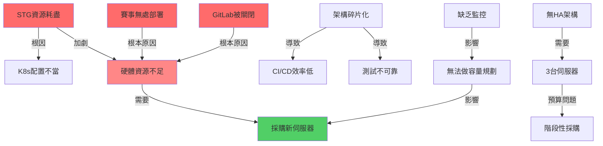
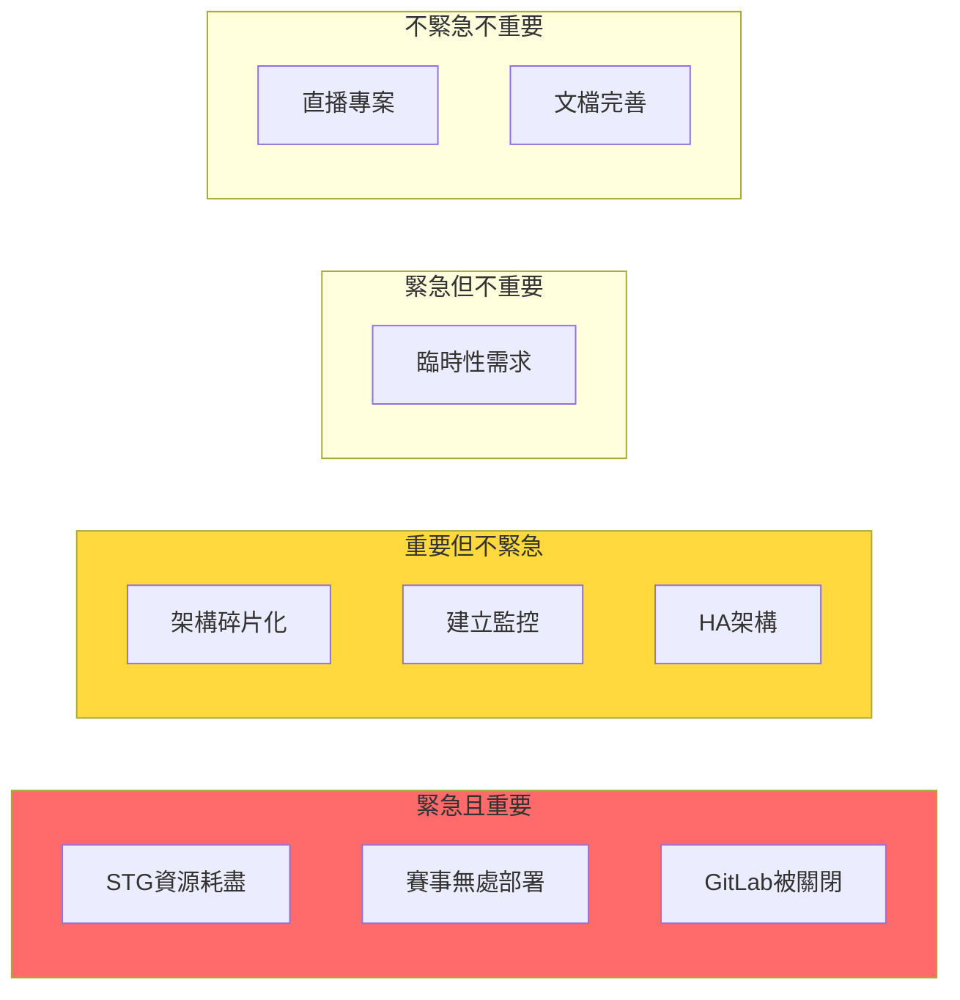

# 現有問題整理與分析

> 基於 `.cursorrules` 配置 | 最後更新: 2024-12-25

## 執行摘要

本公司自 2024 年 5 月開展業務以來，採用外包開發後內部維護的模式運營三大產品線（直播、Video、賽事）。隨著業務快速擴張，現有地端基礎設施已無法支撐需求，特別是在 **2025 年 1 月中賽事上線** 的時間壓力下，問題更加凸顯。

**核心矛盾：**
- **時間**: 1 個月內必須部署賽事環境
- **資源**: 現有機器已飽和，新增服務無處部署
- **預算**: 公司未盈利，難一次投入 120 萬採購 3 台伺服器

## 問題分類與優先級

### P0 級別 - 緊急（必須 1 月前解決）

#### 1. STG 環境資源耗盡但 DEV 正常

**現象：**
- Dev 環境運行流暢
- STG 環境頻繁資源耗盡、服務崩潰
- 兩個環境部署在相同硬體上

**影響：**
- 無法進行測試驗收
- 阻塞賽事 2.0 上線
- 開發團隊效率低落

**可能原因（按機率排序）：**
1. **K8s 資源配置不當** (60%)
   - STG 的 Limits 設定過低
   - 沒有設定 Requests，導致過度分配
   - HPA 配置錯誤，無限擴展

2. **應用層問題** (25%)
   - Java JVM heap 配置不當（STG 與 DEV 配置不一致）
   - PHP-FPM worker 數量設定錯誤
   - 記憶體洩漏（只在 STG 觸發）

3. **測試數據量差異** (10%)
   - STG 使用接近生產的數據量
   - DEV 只用小量測試數據

4. **安全問題** (5%)
   - STG 對外暴露，遭受攻擊
   - 惡意流量或爬蟲

**緊急性**: ⭐⭐⭐⭐⭐（阻塞上線）

---

#### 2. 賽事環境無資源可部署

**現象：**
- 1 月中需部署賽事 dev/stg
- 現有機器已被 Video 專案佔滿
- 無剩餘資源分配

**影響：**
- 賽事無法按時上線
- 業務承諾無法兌現
- 影響公司信譽

**需求評估：**
```
賽事專案（估算）:
- Dev 環境: 2-4 CPU, 4-8 GB RAM
- STG 環境: 4-8 CPU, 8-16 GB RAM
- 數據庫: 2 CPU, 4 GB RAM
- Redis: 1 CPU, 2 GB RAM
---
總需求: 約 10-15 CPU, 20-30 GB RAM
```

**緊急性**: ⭐⭐⭐⭐⭐（業務阻斷）

---

### P1 級別 - 重要（Q1 必須解決）

#### 3. 架構碎片化（ARM64 vs x86）

**現象：**
- 3 台 Mac mini（ARM64 / M 系列晶片）
- 數台 Windows 伺服器（x86_64）
- 部分服務在 dev 是 x86 但 stg 是 ARM64

**影響：**
- **容器映像檔不相容**
  - 需要維護兩套映像檔
  - 建置時間加倍
  - Harbor 儲存空間浪費

- **依賴套件問題**
  - 某些 PHP/Java 擴展在 ARM 上不可用
  - 第三方二進制檔案不支援

- **效能測試失真**
  - STG 測試結果無法反映 PRD 環境
  - 可能上線後才發現問題

**根本原因：**
- 早期資源緊張，什麼機器都拿來用
- 缺乏架構規劃

**建議方案：**
1. **短期**: 統一環境架構（dev/stg/prd 同架構）
2. **中期**: 全面遷移至 x86（相容性最好）
3. **長期**: 或全面遷移至 ARM（成本效益）

**緊急性**: ⭐⭐⭐⭐（技術債）

---

#### 4. GitLab VM 資源搶奪導致關閉

**現象：**
- GitLab 跑在 VM 上，與 K8s 共享宿主機資源
- 經常因資源不足被強制關閉
- 開發團隊無法 push/pull 代碼

**影響：**
- 開發流程中斷
- CI/CD 管道失效
- 團隊效率嚴重受損

**解決方案對比：**

| 方案 | 優勢 | 劣勢 | 成本 | 時效 |
|------|------|------|------|------|
| A. 遷移至雲端 | 流量低、成本可控、立即解決 | 每月費用 | ~$50-100/月 | 1 週 |
| B. 買新機器給 GitLab | 獨立資源、無共享衝突 | 初期投入大 | ~10-15 萬 | 2-4 週 |
| C. 優化現有配置 | 無額外成本 | 治標不治本 | 0 | 1 週 |

**建議**: 方案 A（遷雲），理由：
- GitLab 流量低（純內部使用）
- 雲端月費遠低於買機器
- 可立即釋放地端資源
- 未來資源充裕時可拉回

**緊急性**: ⭐⭐⭐⭐（阻塞開發）

---

#### 5. 缺乏監控與可觀測性

**現象：**
- 不清楚實際資源使用狀況
- 問題發生後才知道（被動式）
- 無法進行容量規劃

**影響：**
- 無數據支撐決策（該買多大的機器？）
- 無法提前預警
- 根因分析困難

**需要建立的監控：**
```yaml
基礎監控:
  - CPU/Memory 使用率
  - 磁碟 I/O 與空間
  - 網路流量與帶寬
  - K8s 資源使用（per Pod/Namespace）

應用監控:
  - QPS（每秒請求數）
  - Response Time
  - Error Rate
  - 併發連線數

業務監控:
  - 視頻播放量
  - 賽事投注量
  - 直播觀看人數
```

**建議工具棧：**
- Prometheus（指標收集）
- Grafana（視覺化）
- Loki（日誌聚合）
- AlertManager（告警）

**緊急性**: ⭐⭐⭐⭐（盲飛狀態）

---

### P2 級別 - 重要但不緊急（Q2 解決）

#### 6. 缺乏 HA（高可用）架構

**現象：**
- 單點故障風險
- 機器故障 = 服務中斷
- 無備援機制

**影響：**
- 可用性無保障
- 業務中斷風險高
- 不符合生產級標準

**GT 建議的 3 節點方案：**
```
3 台伺服器（每台 40 萬）
- 任一台故障，服務仍可運行
- K8s 自動故障轉移
- 符合 HA 最佳實踐
```

**問題：**
- 120 萬預算一次到位困難
- 初期業務量可能不需要這麼高的可用性

**階段性方案：**
- **Phase 1**: 單節點（先活下來）
- **Phase 2**: 2 節點（基本 HA）
- **Phase 3**: 3 節點（完整 HA）

**緊急性**: ⭐⭐⭐（可階段處理）

---

#### 7. CI/CD 管道效率低下

**現象：**
- 建置時間長
- 經常失敗需要重試
- ARM/x86 雙架構加倍建置時間

**影響：**
- 開發效率低
- 部署週期長
- 快速迭代困難

**優化方向：**
- 建置快取策略
- 分層映像檔優化
- 並行建置
- 統一架構（減少重複建置）

**緊急性**: ⭐⭐（影響效率但不阻斷）

---

#### 8. 直播專案外包品質差

**現象：**
- 外包團隊進度拖延
- 代碼品質堪憂
- 內部團隊能力不足接手

**影響：**
- 專案可能流產
- 沉沒成本

**建議：**
- 暫緩處理（如 .cursorrules 所述）
- 優先解決 Video 和賽事
- 評估重新外包或內部重做

**緊急性**: ⭐（暫時擱置）

---

## 問題相互關係



**分析結論：**
1. **資源不足是核心矛盾**，影響多個問題
2. **必須採購新伺服器**，但可以階段性
3. **配置優化也很重要**，不能只靠買硬體
4. **架構碎片化**加劇了資源浪費

---

## 與業界標準對比

### 同規模新創公司（10-50人）

| 項目 | 業界標準 | 本公司現況 | 差距 |
|------|----------|------------|------|
| **基礎設施** | 混合雲（地端+雲端） | 幾乎全地端 | ⚠️ 彈性不足 |
| **監控系統** | Prometheus + Grafana | 無 | ⚠️ 盲飛狀態 |
| **HA 架構** | 至少 2 節點 | 單節點 | ⚠️ 風險高 |
| **CI/CD** | 自動化部署 | 有但不穩定 | ⚠️ 效率低 |
| **架構統一性** | 同一架構 | ARM + x86 混用 | ⚠️ 技術債 |
| **容量規劃** | 基於數據決策 | 憑感覺 | ⚠️ 盲目擴張風險 |

### 影音流量型公司

| 項目 | 業界做法 | 本公司現況 | 評估 |
|------|----------|------------|------|
| **儲存** | 地端大容量 + 雲端 CDN | Mac mini 本地儲存 | ⚠️ 容量不足 |
| **帶寬** | BGP 多線路 | 待確認 | ❓ 需評估 |
| **轉碼** | GPU 伺服器 | 待確認 | ❓ 需評估 |
| **備份** | 異地備援 | 無 | ⚠️ 數據風險 |

---

## 根因分析

### 技術層面

1. **過早優化地端化**
   - 初期應該多用雲端（彈性大）
   - 等流量穩定再評估地端

2. **缺乏架構規劃**
   - 什麼機器都拿來用（Mac mini, Windows）
   - 沒有統一標準

3. **監控滯後**
   - 不知道資源瓶頸在哪
   - 無數據支撐決策

### 管理層面

1. **外包依賴過重**
   - 內部能力建設不足
   - 直播團隊接不住

2. **預算規劃不足**
   - 沒有預留基礎設施預算
   - 臨時申請困難

3. **時間管理問題**
   - 多個專案同時推進
   - 資源排程衝突

---

## 問題優先級矩陣



**處理策略：**
- **紅區（P0）**: 立即行動，1 月前解決
- **黃區（P1）**: Q1 內逐步推進
- **灰區（P2）**: Q2 處理或持續優化

---

## 行動建議

### 立即行動（本週）

1. ✅ **STG 資源耗盡排查**
   - 參考 `02-資源耗盡排查清單.md`
   - GT + CTO 協同排查
   - 找出根本原因

2. ✅ **收集數據**
   - 實際機器配置
   - 實際流量數據
   - 更新 `.cursorrules`

3. ✅ **評估 GitLab 遷雲**
   - 計算雲端成本
   - 制定遷移計劃
   - 1 週內執行

### 短期行動（1 月）

1. ✅ **完成企劃書**
   - 向老闆申請第一筆預算
   - 至少買 1 台伺服器救急

2. ✅ **優化 K8s 配置**
   - 重新設定 Requests/Limits
   - 確保 STG 穩定

3. ✅ **部署賽事環境**
   - 在新機器或優化後的環境部署
   - 確保 1 月中上線

### 中期行動（Q1-Q2）

1. ✅ **建立監控系統**
2. ✅ **解決架構碎片化**
3. ✅ **第 2 台伺服器採購**
4. ✅ **實現基礎 HA**

---

## 成功指標

### 1 月目標
- [ ] STG 環境穩定運行（無資源耗盡）
- [ ] 賽事成功上線
- [ ] GitLab 不再被關閉
- [ ] 獲得第一筆伺服器採購預算

### Q1 目標
- [ ] 監控系統上線
- [ ] 2 節點基礎 HA
- [ ] 架構統一（純 x86 或純 ARM）
- [ ] CI/CD 建置時間減少 50%

### Q2 目標
- [ ] 3 節點完整 HA
- [ ] 基於數據的容量規劃流程
- [ ] 所有專案穩定運營
- [ ] 團隊能力提升（可接手外包專案）

---

## 風險評估

| 風險 | 機率 | 影響 | 緩解措施 |
|------|------|------|----------|
| 預算不批准 | 中 | 高 | 提供多種方案，最低 1 台也要爭取 |
| 賽事延期上線 | 中 | 高 | 優先解決 STG 問題 + 臨時擴容 |
| 新機器到貨延遲 | 低 | 中 | 提前下單 + 備案（租用雲端） |
| 技術方案失敗 | 低 | 中 | 階段性驗證 + 回滾機制 |
| 團隊能力不足 | 中 | 中 | CTO 加強學習 + 外部顧問 |

---

**下一步**: 閱讀 `02-資源耗盡排查清單.md` 開始故障排除

