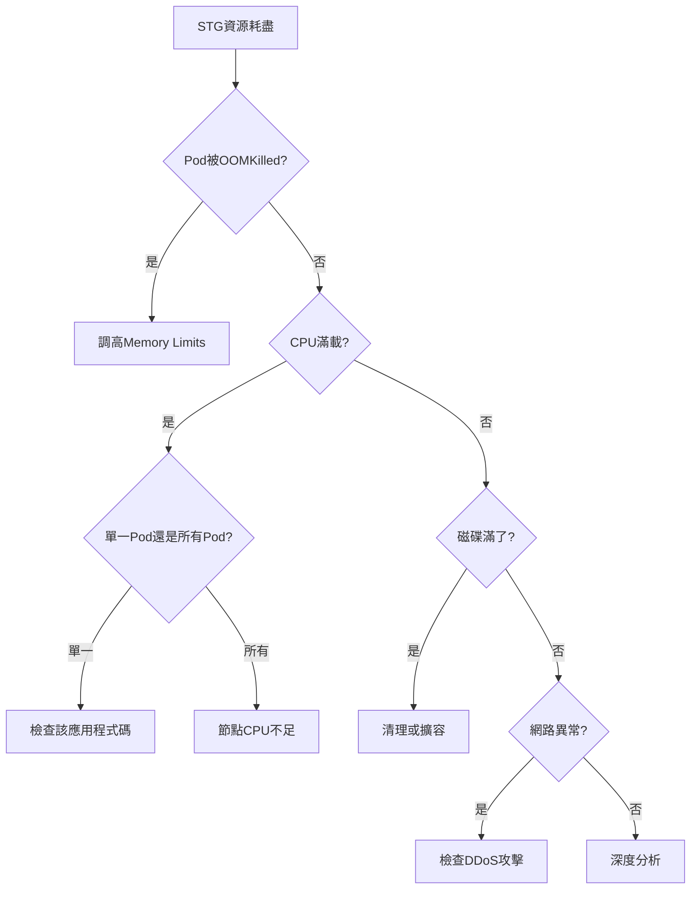

# STG 環境資源耗盡排查清單

> 系統化故障排除指南 | 最後更新: 2024-12-25

## 背景

**問題現象：**
- Dev 環境運行正常
- STG 環境頻繁資源耗盡、服務崩潰、Pod 重啟

**排查目標：**
1. 找出資源耗盡的根本原因
2. 區分是配置問題還是硬體不足
3. 提供立即可執行的解決方案

## 排查流程圖


---

## 第一階段：K8s 資源配置檢查

### 1.1 檢查 Pod 資源限制

**目的：** 確認 Requests 和 Limits 是否設定合理

**檢查命令：**

```bash
# 列出 STG namespace 所有 Pod 的資源配置
kubectl get pods -n stg -o custom-columns=\
NAME:.metadata.name,\
CPU_REQ:.spec.containers[*].resources.requests.cpu,\
CPU_LIM:.spec.containers[*].resources.limits.cpu,\
MEM_REQ:.spec.containers[*].resources.requests.memory,\
MEM_LIM:.spec.containers[*].resources.limits.memory

# 比較 DEV 環境
kubectl get pods -n dev -o custom-columns=\
NAME:.metadata.name,\
CPU_REQ:.spec.containers[*].resources.requests.cpu,\
CPU_LIM:.spec.containers[*].resources.limits.cpu,\
MEM_REQ:.spec.containers[*].resources.requests.memory,\
MEM_LIM:.spec.containers[*].resources.limits.memory
```

**判斷標準：**

| 情況 | 問題 | 解決方案 |
|------|------|----------|
| 沒有設定 Requests | K8s 無法正確調度 | 設定合理的 Requests |
| Limits 過低 | 容器頻繁被 OOMKilled | 調高 Limits |
| Limits 過高 | 過度承諾，節點資源耗盡 | 調整至實際需求 |
| STG 與 DEV 設定不一致 | 環境差異導致問題 | 統一配置 |

**常見配置錯誤：**

```yaml
# ❌ 錯誤範例 1: 沒有設定 requests
resources:
  limits:
    memory: "1Gi"
    cpu: "500m"
  # 缺少 requests！

# ❌ 錯誤範例 2: requests = limits（過於保守）
resources:
  requests:
    memory: "2Gi"
    cpu: "1000m"
  limits:
    memory: "2Gi"
    cpu: "1000m"

# ✅ 正確範例: 合理的 requests 和 limits
resources:
  requests:
    memory: "512Mi"    # 實際需要的最小值
    cpu: "200m"
  limits:
    memory: "1Gi"      # 峰值可以用到的最大值
    cpu: "1000m"
```

---

### 1.2 檢查節點資源使用

**檢查命令：**

```bash
# 查看節點整體資源
kubectl top nodes

# 詳細查看節點分配情況
kubectl describe nodes

# 檢查節點資源分配率
kubectl describe nodes | grep -A 5 "Allocated resources"
```

**判斷標準：**

```
警戒值：
- CPU 使用率 > 80%  → 需要擴容
- Memory 使用率 > 85% → 需要擴容
- CPU 分配率 > 90%  → 過度承諾
- Memory 分配率 > 95% → 過度承諾
```

**輸出範例分析：**

```
Allocated resources:
  CPU Requests    CPU Limits    Memory Requests    Memory Limits
  2000m (50%)     8000m (200%)  4Gi (50%)         16Gi (200%)
                  ^^^^^^^^^^^^                     ^^^^^^^^^^^^^
                  超過 100% = 過度承諾！
```

---

### 1.3 檢查 HPA (Horizontal Pod Autoscaler)

**目的：** 確認自動擴展是否配置錯誤

**檢查命令：**

```bash
# 列出所有 HPA
kubectl get hpa -n stg

# 檢查 HPA 詳情
kubectl describe hpa -n stg

# 查看 HPA 事件
kubectl get events -n stg --field-selector involvedObject.kind=HorizontalPodAutoscaler
```

**常見問題：**

1. **無限擴展**
```yaml
# ❌ 問題配置
spec:
  minReplicas: 1
  maxReplicas: 100  # 太高！
  targetCPUUtilizationPercentage: 50  # 太低！
```

2. **Metrics Server 異常**
```bash
# 檢查 Metrics Server
kubectl get deployment metrics-server -n kube-system
kubectl logs -n kube-system deployment/metrics-server
```

---

### 1.4 檢查 PVC (Persistent Volume Claims)

**目的：** 確認儲存空間是否耗盡

**檢查命令：**

```bash
# 檢查 PVC 使用情況
kubectl get pvc -n stg

# 進入 Pod 檢查實際磁碟使用
kubectl exec -it <pod-name> -n stg -- df -h

# 檢查 inode 使用（常被忽略）
kubectl exec -it <pod-name> -n stg -- df -i
```

**判斷標準：**

```
警戒值：
- 磁碟使用率 > 80%  → 擴容或清理
- inode 使用率 > 90% → 小檔案太多，需清理
```

**常見問題：**
- 日誌檔案爆量
- 臨時檔案未清理
- 數據庫檔案增長未控制

---

## 第二階段：應用層問題檢查

### 2.1 檢查 Java JVM 配置

**Java 應用特別注意事項：**

**檢查命令：**

```bash
# 進入 Java Pod
kubectl exec -it <java-pod> -n stg -- bash

# 檢查 JVM 參數
ps aux | grep java

# 查看 heap 使用情況
jmap -heap <pid>

# 查看記憶體洩漏
jmap -histo:live <pid> | head -n 20
```

**常見問題：**

```bash
# ❌ 問題 1: Heap 設定超過 Pod limits
java -Xmx2g -Xms2g ...
但 Pod limits 只有 1Gi → OOMKilled

# ❌ 問題 2: 沒有設定 heap
java -jar app.jar
默認使用 1/4 物理記憶體 → 可能過大

# ✅ 正確配置
java -Xmx768m -Xms512m -XX:MaxMetaspaceSize=256m -jar app.jar
確保 Xmx + Metaspace + Native < Pod Limit
```

**推薦配置比例：**

```
Pod Memory Limit = 1Gi
├── Heap (Xmx): 700-750Mi (70-75%)
├── Metaspace: 200-256Mi
└── Native + Buffer: 剩餘
```

---

### 2.2 檢查 PHP-FPM 配置

**PHP 應用特別注意事項：**

**檢查命令：**

```bash
# 進入 PHP Pod
kubectl exec -it <php-pod> -n stg -- bash

# 檢查 PHP-FPM 配置
cat /etc/php-fpm.d/www.conf | grep -E 'pm.max_children|pm.start_servers|pm.min_spare_servers|pm.max_spare_servers'

# 查看實際進程數
ps aux | grep php-fpm | wc -l

# 查看每個進程的記憶體使用
ps aux | grep php-fpm | awk '{sum+=$6} END {print sum/1024 " MB"}'
```

**常見問題：**

```ini
# ❌ 問題配置
pm = dynamic
pm.max_children = 50        # 太多！
pm.start_servers = 10
pm.min_spare_servers = 5
pm.max_spare_servers = 20

每個 PHP-FPM 進程 ~50MB
50 個進程 = 2.5GB → 超過 Pod limits

# ✅ 推薦配置（1GB Pod limit）
pm = dynamic
pm.max_children = 15        # 15 * 50MB = 750MB
pm.start_servers = 3
pm.min_spare_servers = 2
pm.max_spare_servers = 5
```

**計算公式：**

```
pm.max_children = (Pod Memory Limit * 0.7) / 單進程記憶體

範例: (1024MB * 0.7) / 50MB ≈ 14-15
```

---

### 2.3 檢查記憶體洩漏

**目的：** 找出應用程式是否有記憶體洩漏

**檢查方法：**

```bash
# 1. 持續監控 Pod 記憶體
watch -n 5 'kubectl top pod -n stg'

# 2. 查看 Pod 重啟歷史
kubectl get pods -n stg -o custom-columns=\
NAME:.metadata.name,\
RESTARTS:.status.containerStatuses[0].restartCount,\
REASON:.status.containerStatuses[0].lastState.terminated.reason

# 3. 查看 OOMKilled 事件
kubectl get events -n stg | grep OOMKilled

# 4. Java heap dump（如果是 Java）
kubectl exec <java-pod> -n stg -- jmap -dump:format=b,file=/tmp/heap.bin <pid>
kubectl cp <pod>:/tmp/heap.bin ./heap.bin
# 使用 Eclipse MAT 分析
```

**判斷標準：**

- 記憶體使用持續上升不下降 → 可能洩漏
- 頻繁 OOMKilled → 配置不當或洩漏
- RESTARTS 次數持續增加 → 有問題

---

### 2.4 檢查連接池配置

**數據庫連接池：**

```bash
# Java (HikariCP)
kubectl logs <pod> -n stg | grep -i "connection"

# PHP (PDO)
kubectl exec <pod> -n stg -- cat /var/www/html/config/database.php
```

**常見問題：**

```php
# ❌ 問題配置
'connections' => [
    'mysql' => [
        'max_connections' => 100,  # 太多！
    ],
],

# ✅ 推薦配置
'connections' => [
    'mysql' => [
        'max_connections' => 10,   # STG 環境不需要太多
    ],
],
```

---

### 2.5 檢查日誌輸出

**目的：** 過多日誌會耗盡磁碟或記憶體

**檢查命令：**

```bash
# 查看日誌輸出速率
kubectl logs <pod> -n stg --tail=100 | wc -l

# 檢查 Pod 內日誌檔案大小
kubectl exec <pod> -n stg -- du -sh /var/log/*

# 檢查 Docker log driver 配置
docker inspect <container-id> | grep LogConfig -A 5
```

**常見問題：**

- Debug 級別的日誌在 STG 開啟
- 未設定日誌輪轉（log rotation）
- 日誌直接寫入容器內（而非 stdout）

**解決方案：**

```yaml
# 設定日誌輪轉
apiVersion: v1
kind: Pod
spec:
  containers:
  - name: app
    env:
    - name: LOG_LEVEL
      value: "INFO"  # 不要用 DEBUG
```

---

## 第三階段：基礎設施檢查

### 3.1 檢查宿主機資源

**檢查命令：**

```bash
# SSH 到宿主機
ssh <node-ip>

# CPU 使用率
top
htop

# 記憶體詳情
free -h
vmstat 5

# 磁碟 I/O
iostat -x 5

# 網路流量
iftop
nethogs
```

**判斷標準：**

```
CPU:
- load average > CPU 核心數 → 過載
- %wa (等待 I/O) > 10% → I/O 瓶頸

Memory:
- free + cache < 10% → 記憶體不足
- swap 使用 > 0 → 已經開始 swap（很慢）

Disk:
- %util > 80% → 磁碟忙碌
- await > 10ms → I/O 延遲高

Network:
- RX/TX 接近頻寬上限 → 網路瓶頸
```

---

### 3.2 檢查 Docker 儲存

**Docker overlay2 常見問題：**

```bash
# 檢查 Docker 磁碟使用
docker system df

# 詳細資訊
docker system df -v

# 檢查未清理的容器/映像檔
docker ps -a | grep Exited | wc -l
docker images | grep none | wc -l
```

**清理命令：**

```bash
# 清理停止的容器
docker container prune -f

# 清理未使用的映像檔
docker image prune -a -f

# 清理未使用的 volume
docker volume prune -f

# 全面清理（小心使用）
docker system prune -a --volumes -f
```

---

### 3.3 檢查網路頻寬

**檢查命令：**

```bash
# 即時網路流量
iftop -i eth0

# 查看連線數
netstat -an | grep ESTABLISHED | wc -l

# 查看 Pod 網路使用（需要 metrics-server）
kubectl top pod -n stg --containers

# 從外部測試頻寬
iperf3 -c <node-ip> -t 30
```

**判斷標準：**

```
警戒值：
- 網路使用率 > 80% 頻寬 → 需要升級
- 連線數 > 10000 → 可能遭受攻擊
- 網路延遲 > 100ms → 異常
```

---

## 第四階段：安全問題檢查

### 4.1 檢查是否遭受 DDoS

**檢查命令：**

```bash
# 查看連線來源 IP
netstat -ntu | awk '{print $5}' | cut -d: -f1 | sort | uniq -c | sort -n

# 查看大量連線的 IP
netstat -ntu | awk '{print $5}' | cut -d: -f1 | sort | uniq -c | sort -n | tail -20

# 查看 SYN_RECV 狀態（半開連線）
netstat -an | grep SYN_RECV | wc -l
```

**判斷標準：**

```
- 單一 IP 連線數 > 100 → 可疑
- SYN_RECV > 1000 → 可能 SYN flood 攻擊
- 大量來自不同 IP 的連線 → DDoS
```

---

### 4.2 檢查挖礦程式

**檢查命令：**

```bash
# 查看 CPU 最高的進程
top -b -n 1 | head -20

# 查看可疑進程
ps aux | grep -E 'xmrig|minerd|cpuminer'

# 查看外連
netstat -antp | grep ESTABLISHED | grep -v '10\.\|172\.\|192\.168\.'

# 查看 cron 定時任務
crontab -l
cat /etc/cron*/*
```

**可疑跡象：**

- CPU 持續 100%
- 未知進程名稱
- 連線到挖礦池（port 3333, 4444 等）
- 從陌生網址下載執行檔

---

### 4.3 檢查內部流量異常

**檢查命令：**

```bash
# 查看 Pod 之間的流量
kubectl get pods -n stg -o wide
tcpdump -i any -n host <pod-ip>

# 查看 DNS 查詢
tcpdump -i any port 53

# 查看 HTTP 請求
kubectl logs <pod> -n stg | grep -E "GET|POST" | head -100
```

---

## 第五階段：深度分析

### 5.1 效能 Profiling

**Java Profiling：**

```bash
# 使用 jProfiler 或 YourKit（商業工具）
# 或使用開源工具
kubectl exec <pod> -n stg -- jstat -gcutil <pid> 1000

# Flame Graph
kubectl exec <pod> -n stg -- perf record -F 99 -p <pid> -g -- sleep 60
```

**PHP Profiling：**

```bash
# 安裝 Xdebug 或 Tideways
# 分析慢查詢
tail -f /var/log/php-fpm/slow.log
```

---

### 5.2 對比 Dev 與 STG 差異

**系統化對比：**

| 檢查項目 | Dev | STG | 差異 |
|----------|-----|-----|------|
| Pod replicas | ? | ? | |
| Resource requests | ? | ? | |
| Resource limits | ? | ? | |
| JVM heap | ? | ? | |
| PHP-FPM children | ? | ? | |
| 數據量大小 | ? | ? | |
| 外部服務調用 | ? | ? | |
| 日誌級別 | ? | ? | |

**檢查命令：**

```bash
# 比較 Deployment 配置
kubectl get deployment <name> -n dev -o yaml > dev.yaml
kubectl get deployment <name> -n stg -o yaml > stg.yaml
diff dev.yaml stg.yaml
```

---

## 快速決策樹



---

## 立即可執行的解決方案

### 方案 A：優化 K8s 配置（1 天內）

```bash
# 1. 調整 Resource Requests/Limits
kubectl edit deployment <name> -n stg

# 2. 縮減不必要的 replicas
kubectl scale deployment <name> -n stg --replicas=2

# 3. 重啟異常 Pod
kubectl rollout restart deployment <name> -n stg
```

### 方案 B：遷移 GitLab 釋放資源（1 週內）

```bash
# 釋放約 2-4 CPU, 4-8GB RAM
# 參考 01-現有問題整理.md 中的分析
```

### 方案 C：臨時擴容（如有預算）

```bash
# 租用雲端 VM 加入 K8s cluster
# 或採購一台新機器
```

---

## 檢查清單（Checklist）

### 必做檢查

- [ ] `kubectl top nodes` - 節點資源使用率
- [ ] `kubectl get pods -n stg` - Pod 狀態
- [ ] `kubectl describe nodes` - 資源分配情況
- [ ] `kubectl logs <pod> -n stg --tail=100` - 應用日誌
- [ ] `kubectl get events -n stg` - 集群事件

### 進階檢查

- [ ] JVM heap 配置（Java）
- [ ] PHP-FPM pm.max_children（PHP）
- [ ] 數據庫連接池配置
- [ ] HPA 配置
- [ ] PVC 使用率
- [ ] 宿主機 CPU/Memory/Disk
- [ ] Docker overlay2 空間

### 安全檢查

- [ ] 異常連線數
- [ ] 可疑進程
- [ ] DDoS 跡象
- [ ] 挖礦程式

---

## 輸出報告模板

完成排查後，填寫以下報告：

```markdown
## STG 資源耗盡根因分析報告

**排查日期**: YYYY-MM-DD
**排查人員**: CTO + GT

### 問題現象
- 描述具體症狀

### 根本原因
- [ ] K8s 配置問題
- [ ] 應用層問題
- [ ] 硬體資源不足
- [ ] 安全攻擊
- [ ] 其他: ___

### 詳細分析
- 具體原因描述
- 數據支撐

### 解決方案
- 立即措施
- 短期方案
- 長期規劃

### 驗證結果
- 是否解決？
- 後續觀察
```

---

**下一步**: 根據排查結果，參考 `03-機器成本評估.md` 制定採購計劃

