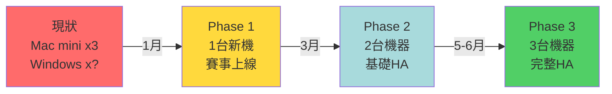
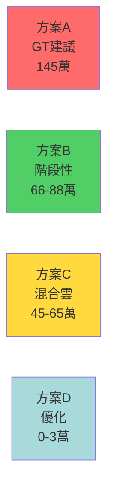

# 機器成本評估與方案對比

> TCO (Total Cost of Ownership) 分析 | 最後更新: 2024-12-25

## 執行摘要

本文檔對比四種基礎設施方案，從初期投資、運營成本、技術風險、實施時間等維度進行全面評估，**推薦採用方案 B（階段性採購）**，在控制風險的前提下滿足業務需求。

## 方案總覽

| 方案 | 初期投資 | 6個月TCO | 適用場景 | 風險 |
|------|----------|----------|----------|------|
| **A. GT建議** | 120萬 | 125萬 | 大型穩定業務 | 低 |
| **B. 階段性採購** | 20-25萬 | 80-100萬 | 初期業務 | 中 |
| **C. 混合雲** | 5-10萬 | 35-50萬 | 靈活擴展 | 中 |
| **D. 優化現有** | 0-3萬 | 5萬 | 應急 | 高 |

---

## 方案 A：GT 建議（3台高階伺服器）

### 配置規格（待確認具體型號）

**單台規格：**
```yaml
CPU: 32-64 cores (Intel Xeon 或 AMD EPYC)
RAM: 128-256 GB DDR4 ECC
Storage: 
  - OS: 2TB NVMe SSD (RAID 1)
  - Data: 8-16TB SSD (RAID 10)
Network: 雙萬兆網卡（10Gbps）
RAID Card: 硬體 RAID 控制器
PSU: 雙電源（冗餘）
Price: 約 40 萬 TWD/台
```

**總規格：**
```
3 台伺服器集群
- Total CPU: 96-192 cores
- Total RAM: 384-768 GB
- Total Storage: 24-48 TB
- Total Cost: 120 萬 TWD
```

### 成本分析

**一次性投資：**
```
伺服器硬體: 120 萬
機櫃與佈線: 3-5 萬
UPS 電源: 5-8 萬
交換機: 5-10 萬（如需升級）
---
總計: 133-143 萬
```

**每月運營成本：**
```
電費: ~1-1.5 萬/月
  - 3台 * 500W * 24h * 30天 * 3.5元/度 ≈ 13,000元
網路: 待確認（已有或需新增）
維護: 人力成本（內部）
---
月運營: 1-2 萬
```

**6個月TCO：**
```
初期投資: 133 萬
運營 6 個月: 12 萬
---
總成本: 145 萬
```

### 優勢

1. **性能強大**
   - 可支撐 3-5 年業務增長
   - 單機性能足夠應對峰值

2. **高可用**
   - 3 節點 K8s HA
   - 任一故障不影響服務
   - 符合生產級標準

3. **運維簡單**
   - 統一硬體規格
   - 配置一致性高
   - 故障排查容易

4. **長期成本低**
   - 攤提 3 年，月均 3.7 萬
   - 無雲端月費

### 劣勢

1. **初期投資大**
   - 一次性 140+ 萬
   - 現金流壓力大

2. **資源利用率低（初期）**
   - 業務量未達預期時浪費
   - 6 個月內可能只用到 30%

3. **彈性不足**
   - 買了就是固定成本
   - 業務調整困難

4. **採購週期長**
   - 下單到交貨 2-4 週
   - 無法立即解決問題

### 適用場景

- 業務已驗證，增長確定
- 預算充足，可一次到位
- 長期規劃，3 年內不變

### 風險評估

| 風險 | 機率 | 影響 | 緩解措施 |
|------|------|------|----------|
| 業務不如預期 | 中 | 高 | 資源浪費，沉沒成本 |
| 預算不批准 | 高 | 高 | 計劃擱置 |
| 規格選錯 | 低 | 中 | 後續升級困難 |

---

## 方案 B：階段性採購（推薦）

### 分階段策略

#### Phase 1（1月）：救急

**採購：1 台中高階伺服器**

```yaml
配置:
  CPU: 16-32 cores
  RAM: 64-128 GB
  Storage: 4-8 TB SSD
  Price: 20-25 萬

用途:
  - 部署賽事 dev/stg
  - 分擔 Video 負載
  - GitLab 可考慮留地端或遷雲
```

**投資：20-25 萬**

#### Phase 2（3月）：穩定

**採購：第 2 台伺服器（同規格）**

```yaml
配置: 與 Phase 1 相同
Price: 20-25 萬

用途:
  - 實現 2 節點基礎 HA
  - 支撐直播專案上線
  - 負載均衡
```

**累計投資：40-50 萬**

#### Phase 3（5-6月）：完善

**採購：第 3 台伺服器 + 升級**

```yaml
選項 A: 再買 1 台同規格（20-25 萬）
選項 B: 買 1 台高階 + 升級前兩台（30-40 萬）

用途:
  - 完整 3 節點 HA
  - 預留未來擴展空間
```

**累計投資：70-90 萬**

### 成本分析

**6 個月TCO：**
```
Phase 1 (1月): 20-25 萬
Phase 2 (3月): 20-25 萬
Phase 3 (5-6月): 20-30 萬
運營成本: 6-8 萬
---
總計: 66-88 萬
```

**平均每月：11-15 萬**

### 優勢

1. **現金流友善**
   - 分批投入，每次 20-30 萬
   - 預算申請容易

2. **彈性調整**
   - 根據實際業務增長決策
   - 可隨時調整 Phase 2/3

3. **風險分散**
   - 驗證後再投入
   - 避免過度投資

4. **快速到貨**
   - 單台採購快
   - 1 月問題可立即解決

5. **逐步建立 HA**
   - Phase 1: 無 HA（救急）
   - Phase 2: 基本 HA（2節點）
   - Phase 3: 完整 HA（3節點）

### 劣勢

1. **總成本略高**
   - 分批買單價可能高 5-10%
   - 運費、安裝多次

2. **運維複雜度提高**
   - 初期需要手動管理
   - 逐步建立 HA 需要技術調整

3. **短期可用性不足**
   - Phase 1 無 HA
   - 單點故障風險

### 適用場景（✅ 完全符合本公司）

- 預算有限，需分批申請
- 業務增長尚不確定
- 時間緊迫，需要快速交付
- 團隊可接受階段性調整

### 技術路線圖



### 階段性技術調整

**Phase 1（單節點）：**
```yaml
架構:
  - 單 K8s master + worker
  - 關鍵服務 replicas=1
  - 無自動故障轉移

風險:
  - 機器故障 = 服務中斷
  - 可接受（dev/stg 環境）

措施:
  - 定期備份
  - 監控告警
```

**Phase 2（2節點）：**
```yaml
架構:
  - 2 K8s workers
  - master 可託管雲端（如 GKE control plane）
  - 關鍵服務 replicas=2

優勢:
  - 基本 HA
  - 單機故障，服務仍可用

限制:
  - etcd 需要外部託管或使用雲端 K8s
```

**Phase 3（3節點）：**
```yaml
架構:
  - 3 masters + 3 workers（或 3 台 mixed mode）
  - etcd 3 節點集群
  - 完整 HA

優勢:
  - 生產級架構
  - 符合業界標準
```

---

## 方案 C：混合雲（地端 + 雲端）

### 架構設計

**地端（高流量服務）：**
```yaml
服務:
  - 影視站（視頻流量大）
  - 色站（視頻流量大）
  - 數據庫（主庫）

硬體:
  - 1-2 台伺服器
  - 大容量儲存
  - 高帶寬網路

投資: 20-40 萬
```

**雲端（低流量或備援）：**
```yaml
服務:
  - GitLab（流量低）
  - 監控系統（Prometheus/Grafana）
  - 賽事 H5（初期流量低）
  - 備援節點（冷備份）
  - CI/CD 建置

雲端方案:
  - AWS EC2 / Azure VM
  - 或台灣本地雲（中華電信雲、遠傳大人物）

月費: 2-5 萬
```

### 成本分析

**初期投資：**
```
地端伺服器: 20-40 萬
雲端設定: 0（隨用隨付）
---
總計: 20-40 萬
```

**每月運營：**
```
地端電費: 5,000-8,000
雲端費用: 20,000-50,000
  - GitLab: $50-100/月
  - 監控: $30-50/月
  - CI/CD: $100-200/月
  - 賽事: $300-500/月（初期）
  - 備援: $100/月（停機狀態）
---
月運營: 2.5-5.8 萬
```

**6 個月TCO：**
```
初期投資: 30 萬
運營 6 個月: 15-35 萬
---
總計: 45-65 萬
```

### 優勢

1. **初期投資最低**
   - 地端只需 1-2 台
   - 雲端隨用隨付

2. **極度彈性**
   - 流量暴增？雲端擴容
   - 流量下降？雲端縮容

3. **快速部署**
   - 雲端幾分鐘內可用
   - 解決 1 月時間壓力

4. **異地備援**
   - 天然的災難恢復
   - 地端故障切雲端

5. **專業維護**
   - 雲端由廠商維護
   - 減少人力成本

### 劣勢

1. **長期成本高**
   - 月費持續支出
   - 3 年可能超過買斷

2. **數據傳輸成本**
   - 地端↔雲端 sync
   - 可能產生額外費用

3. **依賴網路**
   - 專線穩定性要求高
   - 公網不穩定

4. **合規風險**
   - 色站等內容可能不適合上雲
   - 需要確認法規

5. **複雜度提高**
   - 跨雲管理
   - 網路配置複雜

### 適用場景

- 流量不確定性高
- 需要快速擴展
- 有合規要求但部分服務可上雲
- 團隊有雲端管理經驗

### 推薦混合方案

```yaml
地端（自建）:
  - 影視站數據儲存
  - 色站數據儲存
  - 數據庫主庫
  
雲端（託管）:
  - GitLab
  - 監控系統
  - 賽事 H5（初期）
  - CI/CD
  - 備援節點
```

**成本優化策略：**
- 使用 Spot/Preemptible Instance（省 50-70%）
- 預留實例（Savings Plan）
- 台灣本地雲（延遲低，成本合理）

---

## 方案 D：優化現有資源（應急）

### 立即可執行的優化

#### 1. GitLab 遷雲

**釋放資源：**
```
CPU: 2-4 cores
RAM: 4-8 GB
Disk: 100-200 GB
```

**成本：**
```
方案 A: 自建雲端 VM（$50-80/月）
方案 B: 使用 SaaS（GitLab.com，$19/user/月）
```

**時間：1 週**

#### 2. 重新配置 K8s 資源

**優化策略：**
- 降低 replicas（dev 環境 1 個即可）
- 調整 Requests/Limits
- 移除非必要服務

**預期釋放：**
```
CPU: 5-10 cores
RAM: 10-20 GB
```

**成本：0 元**
**時間：2-3 天**

#### 3. 清理與優化

**執行項目：**
- Docker image prune
- Log rotation
- 數據庫清理舊數據
- 移除 dev 環境的測試數據

**預期釋放：**
```
Disk: 500GB - 1TB
```

**成本：0 元**
**時間：1 天**

#### 4. 調整部署策略

**暫時措施：**
- Video dev/stg 共用一套（減少一倍資源）
- 賽事先部署 dev，stg 延後
- 直播專案暫緩

**預期釋放：**
```
CPU: 10-15 cores
RAM: 20-30 GB
```

**成本：0 元（但影響測試流程）**

### 總計優化效果

```
CPU: 17-29 cores
RAM: 34-58 GB
Disk: 500GB - 1.2TB
成本: 0-3 萬（GitLab 雲端 6 個月）
時間: 1-2 週
```

### 優勢

1. **成本最低**（幾乎為 0）
2. **立即可執行**
3. **無需採購流程**

### 劣勢

1. **治標不治本**
   - 無法根本解決資源不足
   - 3 個月後問題會再次出現

2. **影響開發效率**
   - dev/stg 共用降低測試品質
   - 環境衝突風險

3. **不可持續**
   - 只能撐過 1-2 個月
   - 必須搭配採購計劃

### 適用場景

- 應急過渡（等待新機器到貨）
- 與其他方案組合使用
- 預算完全卡死（最後手段）

---

## 方案總對比

### 成本對比（6 個月）



### 多維度評分（滿分 10 分）

| 維度 | 方案A | 方案B | 方案C | 方案D |
|------|-------|-------|-------|-------|
| **性能** | 10 | 7 | 6 | 3 |
| **可靠性** | 10 | 6→9 | 7 | 2 |
| **彈性** | 3 | 7 | 10 | 1 |
| **成本（短期）** | 2 | 6 | 8 | 10 |
| **成本（長期）** | 9 | 8 | 5 | 1 |
| **實施難度** | 6 | 7 | 8 | 9 |
| **時間** | 5 | 8 | 9 | 10 |
| **風險控制** | 9 | 8 | 7 | 4 |
| **適合本公司** | 4 | **9** | 7 | 5 |

### 決策矩陣

```
高性能、低風險 → 方案 A（如預算充足）
平衡、彈性、分散風險 → 方案 B（推薦）
極度彈性、快速部署 → 方案 C（可搭配 B）
應急過渡 → 方案 D（搭配其他方案）
```

---

## 推薦方案：B + C + D 組合

### 組合策略

**第 1 週：方案 D（優化現有）**
```
- GitLab 遷雲（立即釋放資源）
- K8s 配置優化
- 清理與壓縮

目標: 撐過 1 月，確保賽事能部署
成本: 1-2 萬
```

**第 2-4 週：方案 B Phase 1**
```
- 採購第 1 台伺服器（20-25 萬）
- 等待交貨 & 部署
- 賽事 dev/stg 上線

目標: 根本解決資源不足
成本: 20-25 萬
```

**第 2-3 月：方案 C（部分上雲）**
```
- 監控系統上雲
- CI/CD 建置上雲（釋放地端資源）
- 評估賽事是否需要上雲

目標: 增加彈性，釋放地端資源
成本: 2-5 萬/月
```

**第 3-4 月：方案 B Phase 2**
```
- 採購第 2 台伺服器
- 實現基礎 HA

目標: 提高可靠性
成本: 20-25 萬
```

**第 5-6 月：方案 B Phase 3**
```
- 採購第 3 台伺服器
- 完整 HA 架構

目標: 生產級基礎設施
成本: 20-30 萬
```

### 組合方案總成本

```
方案 D（1月）: 1-2 萬
方案 B Phase 1（1月）: 20-25 萬
方案 C（2-6月）: 10-25 萬
方案 B Phase 2（3月）: 20-25 萬
方案 B Phase 3（6月）: 20-30 萬
---
6 個月總計: 71-107 萬
平均每月: 12-18 萬
```

### 組合方案優勢

1. ✅ **立即解決 1 月問題**（方案 D）
2. ✅ **分散預算壓力**（分批申請）
3. ✅ **逐步建立 HA**（方案 B）
4. ✅ **保持彈性**（方案 C）
5. ✅ **風險可控**（每階段驗證）

---

## 採購建議

### 伺服器品牌選擇

| 品牌 | 優勢 | 劣勢 | 價格 |
|------|------|------|------|
| **Dell PowerEdge** | 售後好、穩定 | 較貴 | ⭐⭐⭐⭐ |
| **HP ProLiant** | 性價比高 | 售後普通 | ⭐⭐⭐ |
| **Supermicro** | 便宜、自由度高 | 需自行組裝 | ⭐⭐ |
| **組裝伺服器** | 最便宜、最彈性 | 無保固、風險高 | ⭐ |

**推薦：Dell 或 HP 的中階系列**

### 規格建議（Phase 1）

```yaml
預算 20-25 萬，推薦配置:

CPU: Intel Xeon Silver 4314 (16C/32T) 或同級
RAM: 64GB DDR4 ECC（可擴展至 128GB）
Storage:
  - OS: 2x 480GB SSD RAID 1
  - Data: 4x 2TB SSD RAID 10 = 4TB 可用
Network: 雙 1Gbps（或單 10Gbps）
RAID: 硬體 RAID 控制器
PSU: 雙電源（建議）
Warranty: 3年保固

預估價格: 22-28 萬
```

### 採購渠道

1. **官方代理商**（Dell, HP 台灣）
   - 優勢：原廠保固、售後完整
   - 劣勢：價格較高

2. **系統整合商**（資策會、零壹、神通等）
   - 優勢：可客製、價格有議價空間
   - 劣勢：保固看合約

3. **電商平台**（PChome 企業採購、momo）
   - 優勢：快速、方便
   - 劣勢：規格選擇少

**推薦：官方代理商（保固完整）**

---

## 下一步行動

### 本週

1. ✅ **確認 GT 建議的伺服器具體型號與報價**
2. ✅ **收集實際流量數據，更新 `.cursorrules`**
3. ✅ **評估 GitLab 遷雲的可行性**

### 下週

1. ✅ **完成企劃書初稿**
2. ✅ **向老闆提報，申請 Phase 1 預算**
3. ✅ **如獲批，立即下單採購**

### 1 月底

1. ✅ **新伺服器到貨並部署**
2. ✅ **賽事環境上線**
3. ✅ **驗證方案可行性**

---

**下一步**: 閱讀 `04-備援計畫分析.md` 了解 HA 架構設計

