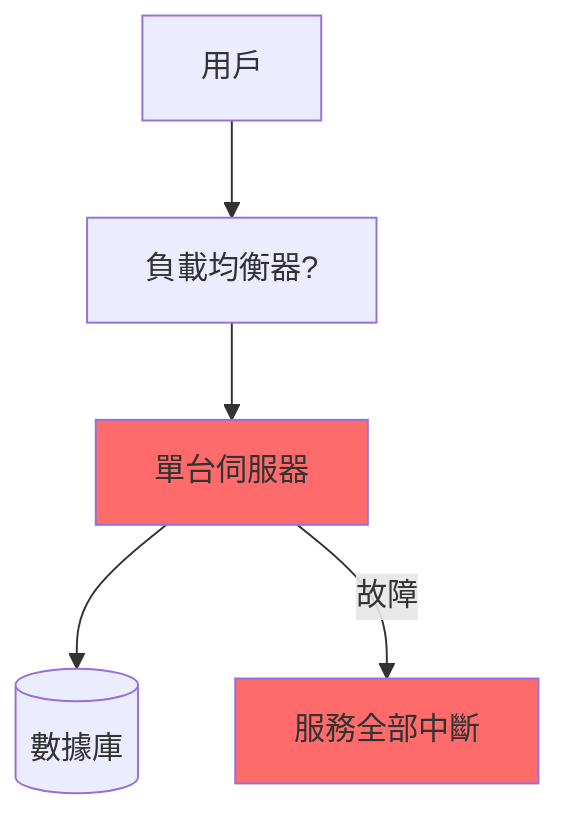
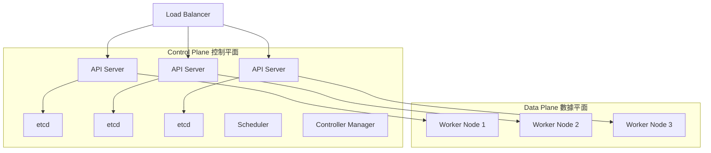
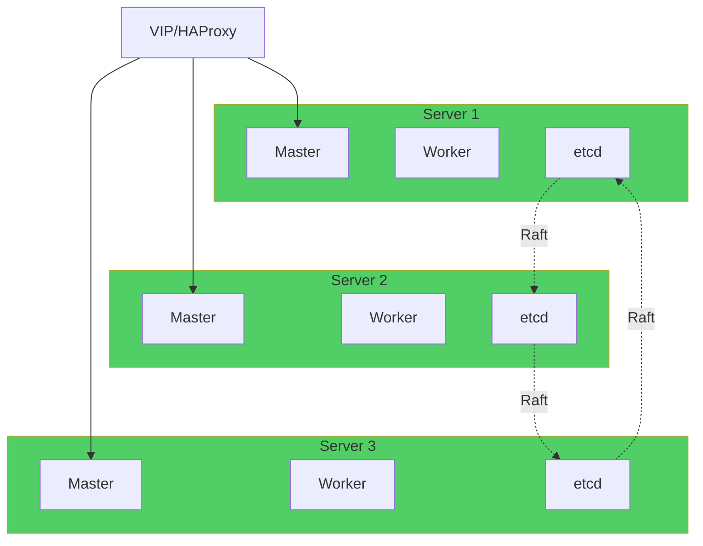
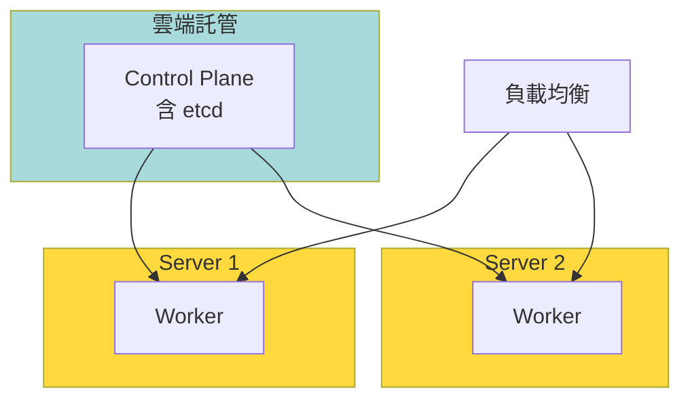
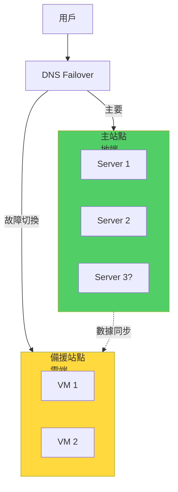

# 備援計畫與高可用架構分析

> HA (High Availability) 方案設計 | 最後更新: 2024-12-25

## 執行摘要

本文檔分析高可用架構的必要性、實現方式及成本，針對公司現況提出**階段性建立 HA 的路徑**，在預算與可靠性間取得平衡。核心結論：**初期單節點可接受，3個月內實現2節點基礎HA，6個月內完成3節點完整HA。**

---

## 為什麼需要 HA？

### 單點故障風險分析

**當前架構（單節點）：**



**風險評估：**

| 故障原因 | 年發生率 | 影響時間 | 業務損失 |
|----------|----------|----------|----------|
| 硬體故障 | 3-5% | 2-8 小時 | 中斷收入 |
| 軟體崩潰 | 10-15% | 0.5-2 小時 | 用戶流失 |
| 網路問題 | 5-8% | 1-4 小時 | 信譽損害 |
| 停電 | 1-2% | 0.5-6 小時 | 數據風險 |
| 人為誤操作 | 10-20% | 0.5-8 小時 | 可預防 |

**年度預期不可用時間：**
```
單節點 SLA: 95-98%
年度停機: 175-438 小時（7-18 天）
```

**對比業界標準：**
```
一般標準: 99.9%（年停機 8.76 小時）
高標準: 99.99%（年停機 52.6 分鐘）
```

---

## Kubernetes HA 架構解析

### K8s 集群組成



**關鍵組件：**

1. **etcd**（集群狀態存儲）
   - 必須 3/5/7 個奇數節點
   - 過半數存活即可工作
   - 最關鍵，掛了集群就廢了

2. **API Server**（控制入口）
   - 可多副本
   - 通過 Load Balancer 分散

3. **Worker Node**（工作節點）
   - 運行實際應用
   - Pod 可在多個 Node 間遷移

---

## 完整 3 節點 HA 方案（GT 建議）

### 架構設計

**配置：3 台相同規格伺服器**



**每台伺服器角色：**
```yaml
Server 1/2/3:
  - etcd member（集群存儲）
  - K8s Master（控制平面）
  - K8s Worker（運行應用）
  
模式: Stacked etcd topology（etcd 與 control plane 共存）
```

### 容錯能力

**可容忍故障數：**
```
3 節點集群:
- 可容忍 1 台完全故障
- etcd 仍有 2/3 過半數
- Pod 自動遷移到存活節點

故障恢復:
- 自動：30秒內 Pod 重新調度
- 手動：修復故障節點或加入新節點
```

**測試場景：**

| 場景 | 結果 | 恢復時間 |
|------|------|----------|
| 1台故障 | ✅ 服務正常 | 0 秒（自動切換）|
| 2台故障 | ❌ 集群不可用 | 需手動恢復 |
| 網路分區（1-2） | ✅ 多數派繼續工作 | 0 秒 |
| 網路分區（平均） | ❌ 無過半數 | 需手動介入 |

### 實現方式

**選項 A：全自建**

```bash
# 使用 kubeadm 建立 HA 集群
# 每台機器上：

# 1. 初始化第一個 master
kubeadm init --control-plane-endpoint="LOAD_BALANCER_DNS:6443" \
             --upload-certs

# 2. 加入其他 master
kubeadm join LOAD_BALANCER_DNS:6443 --token xxx \
             --discovery-token-ca-cert-hash xxx \
             --control-plane --certificate-key xxx

# 3. 加入 worker (同台機器也可以當 worker)
kubectl label node <node-name> node-role.kubernetes.io/worker=worker
```

**需要額外組件：**
- HAProxy 或 Keepalived（VIP 虛擬IP）
- 或硬體 Load Balancer

**優勢：**
- 完全掌控
- 無額外費用

**劣勢：**
- 運維複雜度高
- 需要 K8s HA 專業知識

---

**選項 B：託管 Control Plane**

```yaml
架構:
  Control Plane: 雲端託管（GKE, EKS, AKS）
  Worker Nodes: 地端伺服器（連接至雲端 Control Plane）

優勢:
  - Control Plane 由雲端廠商管理
  - etcd 自動備份
  - 高可用無需自己維護

劣勢:
  - 依賴網路穩定性
  - 地端↔雲端延遲
  - 每月費用（約 $2,000-3,000）

成本:
  - GKE/AKS Control Plane: $0.10/小時 ≈ $72/月
  - 3 個 Control Plane: $216/月
  - Worker 自建：0
```

**推薦場景：**
- 團隊 K8s HA 經驗不足
- 希望減少運維負擔
- 可接受網路延遲

---

### 成本分析

**方案 A：全自建 3 節點**

```
硬體: 120 萬（3台 * 40萬）
網路設備: 5-10 萬（Load Balancer）
電費: 1.5 萬/月
維護: 人力成本
---
初期: 125-130 萬
月運營: 1.5-2 萬
```

**方案 B：託管 Control Plane**

```
硬體: 40-60 萬（2台地端 worker）
Control Plane: 2,000-3,000/月（雲端）
電費: 1 萬/月
---
初期: 40-60 萬
月運營: 3-4 萬
```

**6 個月 TCO：**
- 方案 A: 134 萬
- 方案 B: 58-84 萬

---

## 2 節點基礎 HA 方案（階段性）

### 架構設計



**配置：**
```yaml
地端:
  - Server 1: Worker Node
  - Server 2: Worker Node
  - 應用 Pod replicas >= 2（分散在兩台）

雲端:
  - Managed K8s Control Plane
  - 或單台雲端 VM 跑 master（不推薦）

可容忍:
  - 1 台地端機器故障 → 服務降級但可用
  - Control Plane 由雲端保證 HA
```

### 容錯能力

**優勢：**
- 比單節點強
- 成本僅 40-50 萬
- 基本滿足 dev/stg 需求

**限制：**
- 1 台故障，剩下 1 台可能資源不足
- 需要提前規劃資源（每台至少 50% buffer）

**適用場景：**
- 階段性過渡
- Dev/STG 環境
- 預算有限

---

## 混合備援方案（地端+雲端）

### 主從架構



### 冷備援 vs 熱備援

**冷備援（Cold Standby）：**
```yaml
雲端備援節點:
  狀態: 關機或最小規格
  數據: 每日同步一次
  
故障切換:
  1. 檢測到地端故障
  2. 手動啟動雲端服務
  3. 切換 DNS
  時間: 15-30 分鐘

成本:
  - 雲端 VM: 停機狀態 $10-20/月
  - 數據傳輸: $50-100/月
  月費: $60-120
```

**熱備援（Hot Standby）：**
```yaml
雲端備援節點:
  狀態: 運行中，同步服務
  數據: 即時同步
  
故障切換:
  1. 自動檢測故障
  2. DNS 自動切換
  時間: 1-3 分鐘

成本:
  - 雲端 VM: 運行狀態 $500-1,000/月
  - 數據傳輸: $200-500/月
  月費: $700-1,500
```

### 數據同步策略

**數據庫：**
```yaml
方案 A: 主從複製（MySQL Replication）
  - 地端: Master
  - 雲端: Slave（只讀）
  - 延遲: 1-5 秒

方案 B: 備份恢復
  - 定時 dump 數據庫
  - 上傳至雲端
  - RPO: 1 天（數據可能丟失 24 小時）

推薦: 方案 A（關鍵業務）或 方案 B（成本優先）
```

**文件儲存：**
```yaml
方案 A: rsync 定時同步
  - cron 每小時同步一次
  - 增量傳輸，省頻寬

方案 B: 對象儲存（S3/OSS）
  - 應用直接寫入雲端
  - 天然異地備份
  - 成本: $0.02-0.05/GB/月

推薦: 影視內容用 rsync，其他用對象儲存
```

### 成本分析

**冷備援（推薦）：**
```
初期設定: 1-2 萬（腳本開發）
月費: 1,000-2,000（雲端 + 傳輸）
人力: 定期測試演練

6 個月: 1.6-3.2 萬
```

**熱備援：**
```
月費: 7,000-15,000
6 個月: 4.2-9 萬
```

---

## RTO 與 RPO 目標設定

### 定義

```
RTO (Recovery Time Objective): 容許停機時間
  - 從故障到恢復服務需要多久？
  
RPO (Recovery Point Objective): 容許數據丟失時間
  - 最多可以丟失多久的數據？
```

### 不同業務的目標

| 業務 | RTO | RPO | 建議方案 |
|------|-----|-----|----------|
| **賽事投注** | < 5 分鐘 | < 1 分鐘 | 3 節點 HA + 數據庫主從 |
| **影視站** | < 30 分鐘 | < 1 小時 | 2 節點 + 冷備援 |
| **色站** | < 30 分鐘 | < 1 小時 | 2 節點 + 冷備援 |
| **直播** | < 5 分鐘 | 即時 | 3 節點 HA（未來）|
| **Dev/STG** | < 4 小時 | < 1 天 | 單節點 + 每日備份 |

### 成本與 SLA 的關係

```
單節點: 95-98% SLA, RTO 2-8h, 成本最低
2節點: 99% SLA, RTO 5-30min, 成本中等
3節點: 99.9% SLA, RTO < 5min, 成本高
3節點+異地: 99.95% SLA, RTO < 2min, 成本最高
```

---

## 階段性 HA 建設路徑

### Phase 1（1-2月）：單節點 + 基礎備份

**現況：**
```
架構: 1 台新伺服器
HA: 無
風險: 高
```

**必做：**
```yaml
1. 每日自動備份:
   - 數據庫 dump
   - 配置文件
   - 上傳至雲端

2. 監控告警:
   - 服務存活監控
   - 資源使用告警
   - 故障立即通知

3. 恢復流程文檔:
   - 詳細恢復步驟
   - 定期演練

4. 冷備援準備:
   - 雲端 VM 建立（可關機）
   - 恢復腳本測試
```

**可接受的停機：**
- RTO: 2-4 小時
- RPO: 1 天

---

### Phase 2（3-4月）：2 節點基礎 HA

**架構：**
```
地端: 2 台伺服器
Control Plane: 託管（雲端）或單 master
```

**實現：**
```yaml
1. K8s 雙 worker:
   - 應用 Pod replicas = 2
   - 分散在兩台機器

2. 數據庫主從:
   - Server 1: MySQL Master
   - Server 2: MySQL Slave（或雲端）

3. 負載均衡:
   - HAProxy 或硬體 LB
   - 健康檢查 + 自動切換

4. 冷備援 → 溫備援:
   - 雲端 VM 定期啟動測試
   - 縮短切換時間至 15 分鐘
```

**可接受的停機：**
- RTO: 15-30 分鐘
- RPO: 1 小時

**成本增加：**
```
硬體: +20-25 萬
Control Plane（如託管）: +2,000/月
```

---

### Phase 3（5-6月）：3 節點完整 HA

**架構：**
```
地端: 3 台伺服器
K8s: 完整 HA（etcd 3 節點）
數據庫: Master-Master 或 Galera Cluster
```

**實現：**
```yaml
1. K8s 3 master + 3 worker:
   - 完整 control plane HA
   - etcd 3 節點集群
   - 可容忍 1 台故障

2. 數據庫集群:
   - MySQL Galera（3 節點）
   - 或 PostgreSQL + Patroni

3. 儲存 HA:
   - Ceph 或 Longhorn（分散式儲存）
   - 數據 3 副本

4. 異地備援:
   - 雲端熱備援（可選）
   - 或保持冷備援
```

**可接受的停機：**
- RTO: < 5 分鐘（自動切換）
- RPO: < 5 分鐘（數據庫同步複製）

**成本增加：**
```
硬體: +20-30 萬
不需要託管 Control Plane（省回 2,000/月）
```

---

## 災難恢復演練

### 為什麼需要演練？

> "未經測試的備份 = 沒有備份"

**常見失敗案例：**
- 備份腳本寫錯，實際上沒備份到
- 恢復流程複雜，關鍵時刻執行失敗
- 網路問題導致無法下載備份
- 恢復時間遠超預期

### 演練計劃

**每月演練（Phase 1）：**
```
1. 模擬服務故障
2. 從備份恢復
3. 驗證數據完整性
4. 記錄實際 RTO/RPO
5. 優化流程
```

**每季演練（Phase 2/3）：**
```
1. 模擬整台機器故障
2. 驗證自動切換
3. 手動切換至備援站點
4. 全流程記錄與優化
```

**演練檢查清單：**
```markdown
- [ ] 備份是否完整？
- [ ] 恢復腳本是否正常？
- [ ] 實際 RTO 是否符合目標？
- [ ] 數據是否有丟失？
- [ ] 團隊是否熟悉流程？
- [ ] 文檔是否需要更新？
```

---

## 技術選型建議

### Control Plane 託管方案對比

| 方案 | 成本 | 延遲 | 複雜度 | 推薦度 |
|------|------|------|--------|--------|
| **GKE Autopilot** | $$$ | 高（海外）| 低 | ⭐⭐ |
| **Azure AKS** | $$ | 中（有台灣） | 低 | ⭐⭐⭐ |
| **AWS EKS** | $$$ | 高（海外）| 中 | ⭐⭐ |
| **自建 kubeadm** | $ | 無 | 高 | ⭐⭐⭐⭐ |
| **Rancher** | $ | 無 | 中 | ⭐⭐⭐⭐ |

**推薦：**
- **Phase 1-2**: Rancher（易管理，可託管也可自建）
- **Phase 3**: 自建 kubeadm（完全掌控）

### 數據庫 HA 方案

| 方案 | 複雜度 | 可靠性 | 性能 | 推薦場景 |
|------|--------|--------|------|----------|
| **MySQL Replication** | 低 | 中 | 高 | Phase 1-2 |
| **MySQL Galera Cluster** | 高 | 高 | 中 | Phase 3 |
| **PostgreSQL + Patroni** | 中 | 高 | 高 | Phase 3（如用 PG）|
| **雲端 RDS HA** | 低 | 高 | 中 | 預算充足 |

---

## 方案推薦總結

### 針對本公司（階段性建立）

```yaml
Phase 1 (1-2月):
  架構: 單節點 + 每日備份 + 冷備援
  成本: 20-25 萬 + 2,000/月
  RTO: 2-4 小時
  RPO: 1 天
  適用: dev/stg 可接受

Phase 2 (3-4月):
  架構: 2 節點 + 數據庫主從 + 溫備援
  成本: +20-25 萬 + 3,000/月
  RTO: 15-30 分鐘
  RPO: 1 小時
  適用: 生產環境可接受

Phase 3 (5-6月):
  架構: 3 節點完整 HA + 冷備援
  成本: +20-30 萬
  RTO: < 5 分鐘
  RPO: < 5 分鐘
  適用: 關鍵業務（賽事、直播）
```

### 相對於 GT 建議

**GT 方案（一步到位）：**
- 優勢：穩定、可靠、省心
- 劣勢：初期投資大、彈性低

**階段性方案（推薦）：**
- 優勢：分散風險、彈性調整、現金流友善
- 劣勢：初期可用性略低（但可接受）

---

## 檢查清單

### Phase 1 必做

- [ ] 設定自動備份（每日）
- [ ] 備份上傳至雲端
- [ ] 建立恢復流程文檔
- [ ] 每月演練一次恢復
- [ ] 設定監控告警

### Phase 2 必做

- [ ] 部署第 2 台伺服器
- [ ] 配置 K8s 雙 worker
- [ ] 設定數據庫主從複製
- [ ] 配置負載均衡
- [ ] 驗證故障自動切換

### Phase 3 必做

- [ ] 部署第 3 台伺服器
- [ ] 配置 etcd 3 節點集群
- [ ] 完整 K8s HA 測試
- [ ] 數據庫集群部署
- [ ] 全面災難恢復演練

---

**下一步**: 閱讀 `05-階段性技術調整方案.md` 了解配合採購的技術路線圖

