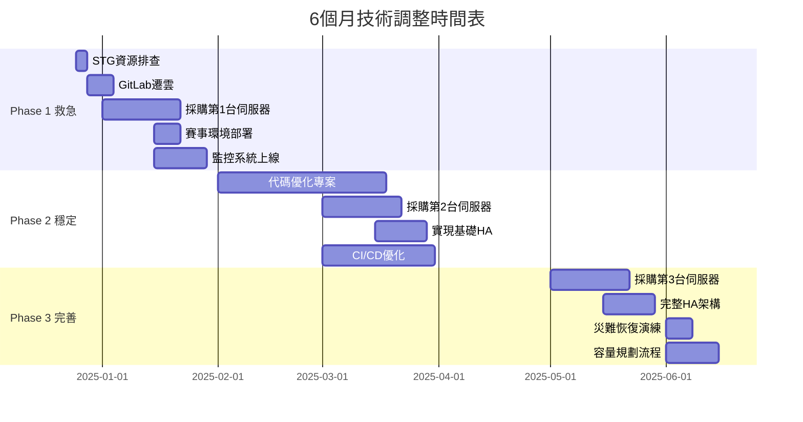
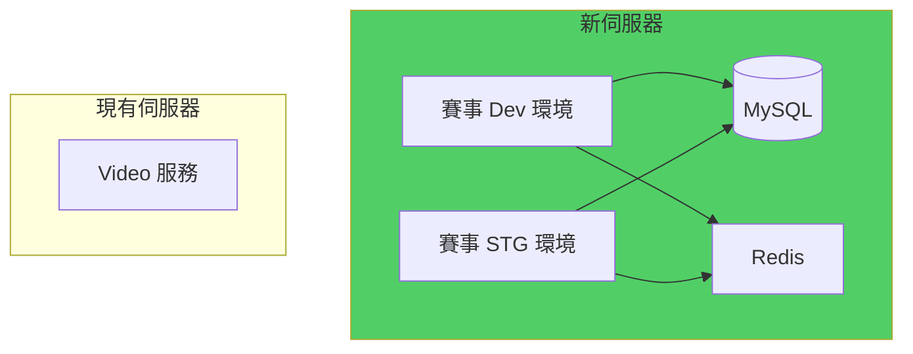
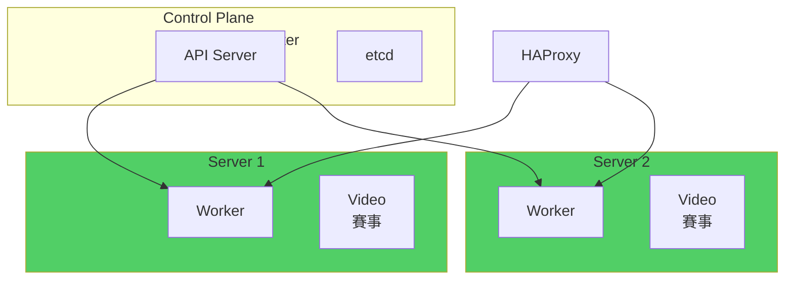
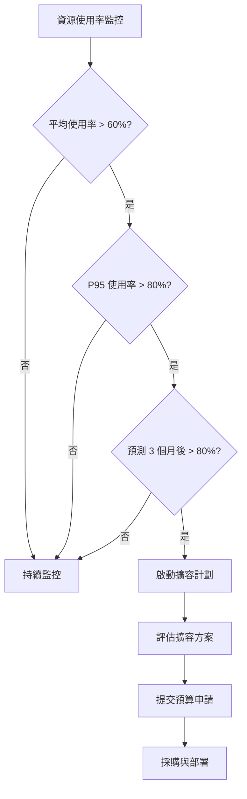

# 階段性技術調整方案

> 與採購計劃同步的技術路線圖 | 最後更新: 2024-12-25

## 執行摘要

本方案將基礎設施建設分為三個階段，每個階段對應不同的硬體投資與技術調整，確保在預算限制下仍能支撐業務發展。**核心策略：先救急（1月），再穩定（Q1），後完善（Q2）**。

---

## 技術路線圖總覽



---

## Phase 1：救急階段（1-2月）

### 目標

- ✅ 解決 STG 環境資源耗盡問題
- ✅ 確保賽事 1 月中順利上線
- ✅ 建立基礎監控能力
- ✅ 釋放現有資源

### 時間表

| 週次 | 工作項目 | 負責人 | 輸出 |
|------|----------|--------|------|
| Week 1 (12/25-12/31) | STG資源耗盡根因分析 | CTO + GT | 排查報告 |
| Week 1-2 | GitLab 遷雲 | GT | 釋放 2-4 CPU |
| Week 2 (1/1-1/7) | 採購第1台伺服器 | CTO | PO 訂單 |
| Week 3 (1/8-1/14) | K8s 配置優化 | GT | 配置文檔 |
| Week 3-4 | 監控系統建立 | GT | Grafana Dashboard |
| Week 4 (1/15-1/21) | 賽事環境部署 | GT | Dev/STG 上線 |

---

### 1.1 STG 資源耗盡根因分析（Week 1）

**執行步驟：**

參考 `02-資源耗盡排查清單.md`，系統化排查：

```bash
# Day 1: K8s 層檢查
kubectl top nodes
kubectl describe nodes
kubectl get hpa -n stg

# Day 2: 應用層檢查
# Java heap, PHP-FPM 配置
kubectl exec -it <pod> -- jmap -heap <pid>

# Day 3: 基礎設施檢查
ssh <node> "top, iostat, free -h"
```

**預期發現：**
- K8s Requests/Limits 配置不當（機率 60%）
- Java JVM heap 過大（機率 25%）
- 測試數據量差異（機率 10%）
- 其他（機率 5%）

**立即修復：**
```yaml
# 調整 Deployment 配置
apiVersion: apps/v1
kind: Deployment
spec:
  replicas: 2  # STG 不需要太多
  template:
    spec:
      containers:
      - name: app
        resources:
          requests:
            memory: "512Mi"
            cpu: "250m"
          limits:
            memory: "1Gi"
            cpu: "1000m"
```

**輸出文檔：**
- STG 資源耗盡根因分析報告
- 優化後的 K8s 配置

---

### 1.2 GitLab 遷移至雲端（Week 1-2）

**方案選擇：**

```yaml
推薦方案: GitLab SaaS (gitlab.com)

理由:
  - 成本最低（$19/user/月，假設 10 人 = $190/月）
  - 無需維護
  - 立即可用
  - 釋放地端資源最多

備選方案: 自建雲端 VM
  - 成本: $80-100/月
  - 需要維護
  - 但可保留完全控制權
```

**遷移步驟：**

```bash
# Day 1: 準備
1. 申請 GitLab.com 帳號（Free tier 先測試）
2. 創建 Group 和 Projects

# Day 2-3: 遷移
3. 備份現有 GitLab
   gitlab-backup create

4. 導出所有 Projects
   # 使用 GitLab API 或手動 export

5. 導入到 GitLab.com
   # 使用 import from URL

# Day 4: CI/CD 配置
6. 更新 .gitlab-ci.yml
7. 配置 GitLab Runner（可在地端跑）
8. 測試 CI/CD 管道

# Day 5: 切換與驗證
9. 更新團隊 Git remote
   git remote set-url origin <new-gitlab-url>
10. 驗證所有功能
11. 關閉舊 GitLab VM
```

**風險與緩解：**
- 風險：遷移失敗或數據丟失
- 緩解：保留舊 GitLab 1 週再關閉

**釋放資源：**
```
CPU: 2-4 cores
RAM: 4-8 GB
Disk: 100-200 GB
```

---

### 1.3 採購第 1 台伺服器（Week 2）

**規格確認：**

參考 `03-機器成本評估.md`，推薦：

```yaml
CPU: 16-32 cores (Intel Xeon Silver 或同級)
RAM: 64-128 GB DDR4 ECC
Storage: 
  - OS: 2x 480GB SSD RAID 1
  - Data: 4x 2TB SSD RAID 10 = 4TB 可用
Network: 雙 1Gbps 或單 10Gbps
Price: 20-25 萬
Brand: Dell PowerEdge 或 HP ProLiant

交貨時間: 2-3 週
```

**採購流程：**
```
Week 2: 提交企劃書 → 老闆批准 → 下單
Week 3: 等待交貨
Week 4: 收貨 → 上架 → 部署 OS
```

---

### 1.4 K8s 配置優化（Week 3）

**在新機器到貨前，優化現有配置：**

#### A. 重新設定 Requests/Limits

**原則：**
```yaml
Requests: 實際需要的最小值（保證資源）
Limits: 峰值可用的最大值（防止無限擴張）

比例建議:
  Limits = Requests * 1.5 ~ 2
```

**範例配置（Java 應用）：**

```yaml
# ❌ 優化前
resources:
  limits:
    memory: "2Gi"
    cpu: "2000m"
  # 沒有 requests！

# ✅ 優化後
resources:
  requests:
    memory: "768Mi"   # 實際穩定使用約 700MB
    cpu: "300m"       # 實際穩定使用 0.2-0.3 core
  limits:
    memory: "1.5Gi"   # 峰值約 1.2GB
    cpu: "1000m"      # 峰值約 0.8 core
    
env:
- name: JAVA_OPTS
  value: "-Xmx700m -Xms512m -XX:MaxMetaspaceSize=256m"
  # 確保 JVM heap < memory limit
```

**範例配置（PHP 應用）：**

```yaml
# ✅ 優化後
resources:
  requests:
    memory: "256Mi"
    cpu: "100m"
  limits:
    memory: "512Mi"
    cpu: "500m"

# 對應的 PHP-FPM 配置
pm = dynamic
pm.max_children = 8        # 8 * 50MB = 400MB < 512MB
pm.start_servers = 2
pm.min_spare_servers = 1
pm.max_spare_servers = 3
```

#### B. 調整 Replicas

```yaml
# Dev 環境
replicas: 1  # 夠用即可

# STG 環境
replicas: 2  # 基本 HA

# PRD 環境（未來）
replicas: 3  # 完整 HA
```

#### C. 禁用不必要的服務

```bash
# 審查所有 Deployment
kubectl get deploy --all-namespaces

# 暫停非必要服務
kubectl scale deployment <name> -n <ns> --replicas=0

# 範例：dev 環境的 metrics-server 可以關閉
```

**預期效果：**
```
釋放資源:
  CPU: 10-15 cores
  RAM: 20-30 GB
  
足以部署賽事 dev 環境
```

---

### 1.5 監控系統建立（Week 3-4）

**選型：Prometheus + Grafana**

**為什麼選這套？**
- 業界標準
- K8s 原生支援
- 開源免費
- 社群活躍

#### 部署方案

**選項 A：使用 kube-prometheus-stack（推薦）**

```bash
# 使用 Helm 安裝（快速）
helm repo add prometheus-community \
  https://prometheus-community.github.io/helm-charts
  
helm install kube-prometheus-stack \
  prometheus-community/kube-prometheus-stack \
  --namespace monitoring \
  --create-namespace \
  --set prometheus.prometheusSpec.retention=15d \
  --set grafana.adminPassword=<strong-password>

# 5 分鐘內完成部署
```

**包含組件：**
- Prometheus（指標收集）
- Grafana（視覺化）
- AlertManager（告警）
- Node Exporter（節點指標）
- Kube-state-metrics（K8s 指標）

#### 必備 Dashboard

```yaml
1. 節點資源監控:
   - CPU/Memory 使用率
   - 磁碟 I/O
   - 網路流量

2. K8s 集群監控:
   - Pod 狀態
   - Deployment 健康度
   - Namespace 資源使用

3. 應用監控:
   - HTTP 請求量（QPS）
   - 錯誤率
   - Response Time

4. 業務監控:
   - 視頻播放量
   - 賽事投注量（未來）
   - 用戶數
```

#### 告警規則

**關鍵告警：**

```yaml
# alerts.yaml
groups:
- name: infrastructure
  rules:
  - alert: NodeMemoryHigh
    expr: node_memory_MemAvailable_bytes / node_memory_MemTotal_bytes < 0.1
    for: 5m
    annotations:
      summary: "Node {{ $labels.instance }} memory < 10%"
      
  - alert: PodCrashLooping
    expr: rate(kube_pod_container_status_restarts_total[15m]) > 0
    annotations:
      summary: "Pod {{ $labels.pod }} is crash looping"
      
  - alert: HighCPUUsage
    expr: (100 - (avg by (instance) (irate(node_cpu_seconds_total{mode="idle"}[5m])) * 100)) > 80
    for: 10m
    annotations:
      summary: "Node {{ $labels.instance }} CPU > 80%"
```

**通知渠道：**
- Email（CTO + GT）
- Slack/Discord（團隊頻道）
- 簡訊（P0 級別）

**輸出：**
- Grafana 訪問地址
- Dashboard 列表
- 告警規則文檔

---

### 1.6 賽事環境部署（Week 4）

**前置條件：**
- 新伺服器已到貨並上架 ✅
- K8s node 已加入集群 ✅
- 賽事 2.0 外包已驗收 ✅

**部署架構：**



**資源分配：**

```yaml
賽事 Dev:
  replicas: 1
  resources:
    requests: {cpu: "250m", memory: "512Mi"}
    limits: {cpu: "1000m", memory: "1Gi"}

賽事 STG:
  replicas: 2
  resources:
    requests: {cpu: "500m", memory: "1Gi"}
    limits: {cpu: "2000m", memory: "2Gi"}

MySQL:
  resources: {cpu: "1000m", memory: "2Gi"}
  
Redis:
  resources: {cpu: "100m", memory: "256Mi"}

---
總需求: ~4-6 CPU, 8-12 GB RAM
新伺服器（16-32 core, 64-128GB）完全足夠
```

**部署流程：**

```bash
# Day 1: 準備
1. 準備 K8s manifests（或 Helm charts）
2. 準備數據庫 schema
3. 準備環境變數（secrets）

# Day 2: Dev 環境
4. 部署數據庫
   kubectl apply -f mysql-deployment.yaml
5. 導入 schema
6. 部署應用
   kubectl apply -f sports-dev.yaml
7. 測試驗證

# Day 3: STG 環境
8. 複製配置並調整
9. 部署 STG
10. 數據同步（如需要）

# Day 4-5: 驗收測試
11. 功能測試
12. 壓力測試
13. 與 IM App 對接測試
```

**驗收標準：**
- [ ] 所有 API 功能正常
- [ ] 與 IM App JSBridge 對接成功
- [ ] Dev 環境可供開發使用
- [ ] STG 環境穩定（無資源耗盡）

---

### Phase 1 總結

**達成指標：**
- ✅ STG 環境穩定（無 OOM）
- ✅ 賽事順利上線
- ✅ GitLab 遷雲，釋放資源
- ✅ 基礎監控上線

**資源狀況：**
```
新增: 1 台伺服器（16-32 core, 64-128 GB）
釋放: GitLab（2-4 core, 4-8 GB）+ 配置優化（10-15 core, 20-30 GB）
淨增: 24-43 core, 80-146 GB

可支撐: Video + 賽事，還有餘裕
```

**投資：**
```
伺服器: 20-25 萬
GitLab SaaS: $190/月 ≈ 6,000/月
監控: 0（開源）
---
總計: 20-25 萬 + 6k/月
```

---

## Phase 2：穩定階段（3-4月）

### 目標

- ✅ 實現基礎 HA（2 節點）
- ✅ 代碼優化，減少資源消耗
- ✅ CI/CD 管道優化
- ✅ 為直播上線做準備

### 時間表

| 週次 | 工作項目 | 負責人 | 輸出 |
|------|----------|--------|------|
| Week 5-8 (2月) | 代碼優化專案 | 各產品團隊 | 記憶體減少 20% |
| Week 9 (3/1-3/7) | 採購第2台伺服器 | CTO | PO 訂單 |
| Week 10-11 | CI/CD 優化 | GT | 建置時間減半 |
| Week 12 (3/15-3/21) | 實現基礎 HA | GT | 2 節點集群 |
| Week 13-14 | HA 測試與驗證 | GT | 故障切換測試 |

---

### 2.1 代碼優化專案（2月）

**目標：減少資源消耗 20%**

#### A. Java 應用優化

**排查工具：**

```bash
# 1. 使用 JProfiler 或 VisualVM 分析
# 找出記憶體熱點

# 2. Heap Dump 分析
jmap -dump:format=b,file=heap.bin <pid>
# 使用 Eclipse MAT 分析

# 3. GC 日誌分析
-XX:+PrintGCDetails -XX:+PrintGCDateStamps \
-Xloggc:/var/log/gc.log
```

**常見優化點：**

```java
// ❌ 優化前：每次請求都創建新對象
public class UserService {
    public User getUser(int id) {
        SimpleDateFormat sdf = new SimpleDateFormat("yyyy-MM-dd");
        // 每次創建 SimpleDateFormat 很重
        ...
    }
}

// ✅ 優化後：複用對象
public class UserService {
    private static final ThreadLocal<SimpleDateFormat> sdf = 
        ThreadLocal.withInitial(() -> new SimpleDateFormat("yyyy-MM-dd"));
    
    public User getUser(int id) {
        // 複用，減少 GC 壓力
        ...
    }
}
```

```java
// ❌ 優化前：未關閉資源
ResultSet rs = stmt.executeQuery(sql);
// 忘記關閉 → 連接洩漏

// ✅ 優化後：try-with-resources
try (ResultSet rs = stmt.executeQuery(sql)) {
    // 自動關閉
}
```

**JVM 參數調優：**

```bash
# ❌ 優化前（默認）
java -jar app.jar

# ✅ 優化後
java \
  -Xmx768m -Xms512m \
  -XX:MaxMetaspaceSize=256m \
  -XX:+UseG1GC \
  -XX:MaxGCPauseMillis=200 \
  -XX:+HeapDumpOnOutOfMemoryError \
  -XX:HeapDumpPath=/tmp/heapdump.hprof \
  -jar app.jar
```

#### B. PHP 應用優化

**排查工具：**

```bash
# 1. Xdebug profiling
# 找出慢函數

# 2. 查看慢查詢日誌
tail -f /var/log/php-fpm/slow.log

# 3. OPcache 配置檢查
php -i | grep opcache
```

**常見優化點：**

```php
// ❌ 優化前：每次查詢數據庫
public function getUser($id) {
    return DB::table('users')->find($id);
}

// ✅ 優化後：使用 Redis 快取
public function getUser($id) {
    $key = "user:$id";
    return Cache::remember($key, 3600, function() use ($id) {
        return DB::table('users')->find($id);
    });
}
```

```php
// ❌ 優化前：N+1 查詢
$users = User::all();
foreach ($users as $user) {
    echo $user->profile->name;  // 每次都查詢
}

// ✅ 優化後：Eager Loading
$users = User::with('profile')->get();
foreach ($users as $user) {
    echo $user->profile->name;  // 一次查詢
}
```

#### C. 數據庫優化

**排查工具：**

```sql
-- 1. 慢查詢日誌
SHOW VARIABLES LIKE 'slow_query_log%';
SET GLOBAL slow_query_log = 'ON';
SET GLOBAL long_query_time = 1;

-- 2. 查看執行計劃
EXPLAIN SELECT * FROM users WHERE email = 'xxx';

-- 3. 查看索引使用情況
SHOW INDEX FROM users;
```

**常見優化：**

```sql
-- ❌ 問題查詢：全表掃描
SELECT * FROM orders WHERE created_at > '2024-01-01';

-- ✅ 優化：加索引
CREATE INDEX idx_created_at ON orders(created_at);

-- ❌ 問題查詢：SELECT *
SELECT * FROM users WHERE id = 1;

-- ✅ 優化：只查需要的欄位
SELECT id, name, email FROM users WHERE id = 1;
```

**預期效果：**
```
Java heap: 1GB → 800MB（減少 20%）
PHP memory: 512MB → 400MB（減少 22%）
數據庫連接: 100 → 50（減少 50%）
---
總體資源需求減少 15-20%
```

---

### 2.2 採購第 2 台伺服器（3月）

**規格：與第 1 台相同（統一管理）**

```yaml
CPU: 16-32 cores
RAM: 64-128 GB
Storage: 4TB SSD
Price: 20-25 萬
```

**用途規劃：**
```
Server 1: Video + 賽事（主）
Server 2: Video + 賽事（備援）+ 直播（未來）
```

---

### 2.3 CI/CD 優化（Week 10-11）

**目標：建置時間減少 50%**

#### A. Docker 映像檔優化

**優化前：**

```dockerfile
# ❌ 問題：每次都重新安裝依賴
FROM openjdk:11
COPY . /app
WORKDIR /app
RUN ./gradlew build  # 每次都下載依賴
CMD ["java", "-jar", "app.jar"]

# 建置時間：5-10 分鐘
```

**優化後：**

```dockerfile
# ✅ 優化：分層建置，利用快取
FROM openjdk:11 AS builder
WORKDIR /app

# 1. 先複製依賴定義檔（較少變動）
COPY build.gradle settings.gradle gradle/ ./
RUN ./gradlew dependencies --no-daemon

# 2. 再複製源碼（經常變動）
COPY src/ ./src/
RUN ./gradlew build --no-daemon

# 3. 運行時映像檔（更小）
FROM openjdk:11-jre-slim
COPY --from=builder /app/build/libs/*.jar app.jar
CMD ["java", "-jar", "app.jar"]

# 建置時間：首次 5 分鐘，後續 2 分鐘（快取命中）
```

#### B. 並行建置

**優化前：**

```yaml
# .gitlab-ci.yml - 串行建置
stages:
  - build
  - test
  - deploy

build_video:
  stage: build
  script: docker build -t video:latest .
  
build_sports:
  stage: build
  script: docker build -t sports:latest .
  # 等待 build_video 完成才開始
```

**優化後：**

```yaml
# ✅ 並行建置
stages:
  - build
  - test
  - deploy

.build_template: &build_template
  stage: build
  script:
    - docker build -t $CI_REGISTRY_IMAGE:$CI_COMMIT_SHA .
    - docker push $CI_REGISTRY_IMAGE:$CI_COMMIT_SHA

build_video:
  <<: *build_template
  
build_sports:
  <<: *build_template
  # 同時建置，不等待
```

#### C. 建置快取

**配置 GitLab Runner：**

```toml
# /etc/gitlab-runner/config.toml
[[runners]]
  [runners.docker]
    volumes = ["/cache", "/var/run/docker.sock:/var/run/docker.sock"]
  [runners.cache]
    Type = "s3"  # 或 local
    Shared = true
```

**使用快取：**

```yaml
# .gitlab-ci.yml
cache:
  key: ${CI_COMMIT_REF_SLUG}
  paths:
    - .gradle/
    - node_modules/
    - vendor/  # PHP composer
```

**預期效果：**
```
建置時間:
  首次: 8-10 分鐘
  快取命中: 3-5 分鐘（減少 50-60%）
```

---

### 2.4 實現基礎 HA（Week 12）

參考 `04-備援計畫分析.md` 的 Phase 2 方案。

**架構：2 Worker + 託管 Control Plane**



**實施步驟：**

```bash
# 選項 A：使用 Rancher（簡化管理）
1. 安裝 Rancher Server（可在雲端）
2. 通過 Rancher UI 創建 K8s 集群
3. 加入兩台 Worker Node
4. 自動配置 HA

# 選項 B：自建單 Master（簡化版）
1. Server 1 當 Master + Worker
2. Server 2 當 Worker
3. 應用 Pod replicas = 2，分散部署
```

**應用配置：**

```yaml
# deployment.yaml
apiVersion: apps/v1
kind: Deployment
metadata:
  name: video-service
spec:
  replicas: 2  # 2 副本
  template:
    spec:
      affinity:
        podAntiAffinity:  # 避免在同一節點
          requiredDuringSchedulingIgnoredDuringExecution:
          - labelSelector:
              matchExpressions:
              - key: app
                operator: In
                values:
                - video-service
            topologyKey: kubernetes.io/hostname
```

**負載均衡配置：**

```bash
# 安裝 MetalLB（Bare-metal Load Balancer）
kubectl apply -f https://raw.githubusercontent.com/metallb/metallb/v0.13.7/config/manifests/metallb-native.yaml

# 配置 IP 池
apiVersion: metallb.io/v1beta1
kind: IPAddressPool
metadata:
  name: default
  namespace: metallb-system
spec:
  addresses:
  - 192.168.1.240-192.168.1.250
```

**測試故障切換：**

```bash
# 1. 查看 Pod 分佈
kubectl get pods -o wide

# 2. 模擬 Server 1 故障
ssh server1 "sudo shutdown -h now"

# 3. 觀察 Pod 遷移（30-60秒）
watch kubectl get pods

# 4. 驗證服務可用
curl http://service-ip/health
```

---

### Phase 2 總結

**達成指標：**
- ✅ 2 節點基礎 HA
- ✅ 代碼優化，資源減少 15-20%
- ✅ CI/CD 建置時間減半
- ✅ 可容忍 1 台機器故障

**投資：**
```
伺服器: +20-25 萬
Control Plane（如託管）: +2,000/月
---
累計: 40-50 萬 + 8k/月
```

---

## Phase 3：完善階段（5-6月）

### 目標

- ✅ 完整 3 節點 HA
- ✅ 災難恢復演練
- ✅ 容量規劃流程
- ✅ 團隊能力提升

### 時間表

| 週次 | 工作項目 | 負責人 | 輸出 |
|------|----------|--------|------|
| Week 17 (5/1-5/7) | 採購第3台伺服器 | CTO | PO 訂單 |
| Week 19-20 | 完整 HA 架構 | GT | 3 節點集群 |
| Week 21 | etcd 集群配置 | GT | etcd HA |
| Week 22 | 災難恢復演練 | CTO + GT | 演練報告 |
| Week 23-24 | 容量規劃流程 | CTO | 流程文檔 |

---

### 3.1 採購第 3 台伺服器（5月）

**規格選擇：**

```yaml
選項 A: 與前兩台相同（統一管理）
  CPU: 16-32 cores
  RAM: 64-128 GB
  Price: 20-25 萬

選項 B: 更高規格（為未來擴展）
  CPU: 32-64 cores
  RAM: 256 GB
  Price: 30-40 萬
  
推薦: 選項 A（先統一，未來再升級）
```

---

### 3.2 完整 3 節點 HA（Week 19-21）

參考 `04-備援計畫分析.md` 的 Phase 3 方案。

**架構：3 Master + 3 Worker（同機）**

```bash
# 使用 kubeadm 建立 HA 集群

# 1. 在 Server 1 初始化第一個 master
kubeadm init --control-plane-endpoint="192.168.1.100:6443" \
  --upload-certs \
  --pod-network-cidr=10.244.0.0/16

# 2. 在 Server 2 和 3 加入為 master
kubeadm join 192.168.1.100:6443 \
  --token <token> \
  --discovery-token-ca-cert-hash sha256:<hash> \
  --control-plane \
  --certificate-key <key>

# 3. 部署 CNI（如 Calico）
kubectl apply -f calico.yaml

# 4. 驗證 etcd 集群
kubectl exec -it -n kube-system etcd-server1 -- \
  etcdctl member list
```

**配置 VIP（Virtual IP）：**

```yaml
# 使用 Keepalived + HAProxy
# 或使用雲端 Load Balancer

# HAProxy 配置
frontend kubernetes-frontend
  bind *:6443
  mode tcp
  default_backend kubernetes-backend

backend kubernetes-backend
  mode tcp
  balance roundrobin
  server master1 192.168.1.101:6443 check
  server master2 192.168.1.102:6443 check
  server master3 192.168.1.103:6443 check
```

---

### 3.3 災難恢復演練（Week 22）

**演練場景：**

#### 場景 1：單節點故障

```bash
# 1. 模擬 Server 2 故障
ssh server2 "sudo shutdown -h now"

# 2. 驗證：
- etcd 集群仍正常（2/3 過半數）
- Pod 自動遷移至 Server 1 和 3
- 服務無中斷

# 3. 恢復：
開機 Server 2，自動重新加入

# 預期 RTO: < 1 分鐘
```

#### 場景 2：數據中心斷電

```bash
# 1. 模擬：所有服務器關機
# 2. 啟動順序：
   - 先啟動所有 master（etcd）
   - 等待 etcd 集群恢復
   - Worker 自動加入
   - 應用 Pod 自動恢復

# 預期 RTO: 5-10 分鐘
```

#### 場景 3：etcd 數據損壞

```bash
# 1. 從備份恢復 etcd
etcdctl snapshot restore snapshot.db

# 2. 重建集群
# 3. 驗證數據完整性

# 預期 RTO: 15-30 分鐘
```

**演練檢查清單：**

```markdown
- [ ] 備份是否可用？
- [ ] 恢復流程是否正確？
- [ ] 實際 RTO 是否符合目標？
- [ ] 團隊是否熟悉流程？
- [ ] 文檔是否需要更新？
- [ ] 自動化腳本是否正常？
```

---

### 3.4 容量規劃流程（Week 23-24）

**建立數據驅動的容量規劃：**

#### A. 數據收集

```yaml
每週收集:
  - CPU/Memory 使用率（P50, P95, P99）
  - 網路流量
  - 磁碟 I/O
  - QPS 峰值
  - 用戶數增長

每月分析:
  - 增長趨勢
  - 容量預測（3/6/12 個月）
  - 瓶頸識別
```

#### B. 容量模型

```python
# 簡單的容量預測模型
def predict_capacity(current_usage, growth_rate, months):
    """
    current_usage: 當前資源使用率（%）
    growth_rate: 月增長率（%）
    months: 預測月份
    """
    future_usage = current_usage * (1 + growth_rate) ** months
    
    if future_usage > 70:  # 70% 為警戒線
        return "需要擴容"
    else:
        return "容量充足"

# 範例
predict_capacity(current_usage=50, growth_rate=0.1, months=6)
# 輸出: 50% * 1.1^6 = 88.6% → "需要擴容"
```

#### C. 擴容決策樹



---

### Phase 3 總結

**達成指標：**
- ✅ 3 節點完整 HA
- ✅ 生產級基礎設施
- ✅ 災難恢復能力驗證
- ✅ 數據驅動的容量規劃

**投資：**
```
伺服器: +20-30 萬
---
累計: 60-80 萬
```

---

## 技術債務管理

### 已知技術債

| 技術債 | 優先級 | 預計處理時間 |
|--------|--------|--------------|
| 架構碎片化（ARM/x86） | P1 | Phase 2 |
| 缺乏自動化測試 | P2 | Phase 3 |
| 直播外包代碼品質 | P2 | 待評估 |
| 缺乏 API 文檔 | P3 | Phase 3 |

### 債務償還計劃

```yaml
Phase 1: 不新增技術債（優先還債）
Phase 2: 償還 P1 債務
Phase 3: 償還 P2 債務
```

---

## 團隊能力建設

### K8s 學習計劃（CTO 週末）

**Day 1（週六）：基礎概念**
- Pod, Deployment, Service
- Resource Management
- ConfigMap & Secret

**Day 2（週日）：進階運維**
- Troubleshooting（kubectl debug）
- Logging & Monitoring
- HA 架構理解

**推薦資源：**
- Kubernetes 官方文檔
- CKAD 練習題

### 團隊培訓計劃

```yaml
2月: K8s 基礎培訓（全員）
3月: Java 性能優化（Java 團隊）
4月: PHP 性能優化（PHP 團隊）
5月: 災難恢復演練（全員）
6月: 容量規劃工作坊（Tech Lead）
```

---

## 風險管理

### 風險清單

| 風險 | 機率 | 影響 | 緩解措施 |
|------|------|------|----------|
| 伺服器延遲交貨 | 中 | 高 | 提前 2 週下單 |
| 技術方案失敗 | 低 | 中 | 分階段驗證 |
| 團隊能力不足 | 中 | 中 | 培訓 + 外部顧問 |
| 預算追加困難 | 高 | 高 | 分階段申請 |

---

## 成功指標

### Phase 1（2月底）
- [ ] STG 環境 30 天無資源耗盡
- [ ] 賽事成功上線並穩定運行
- [ ] 監控系統可用，有告警

### Phase 2（4月底）
- [ ] 2 節點 HA 上線
- [ ] 代碼優化完成，資源減少 15%+
- [ ] CI/CD 建置時間減少 40%+

### Phase 3（6月底）
- [ ] 3 節點 HA 上線
- [ ] 災難恢復演練通過
- [ ] 容量規劃流程建立

---

**下一步**: 閱讀兩份企劃書，準備向上溝通

